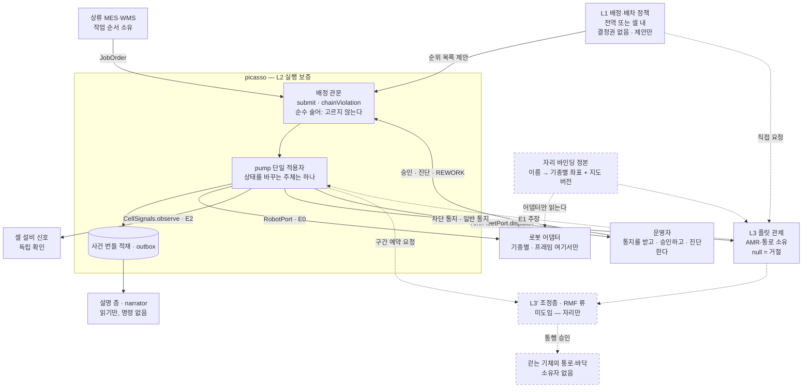
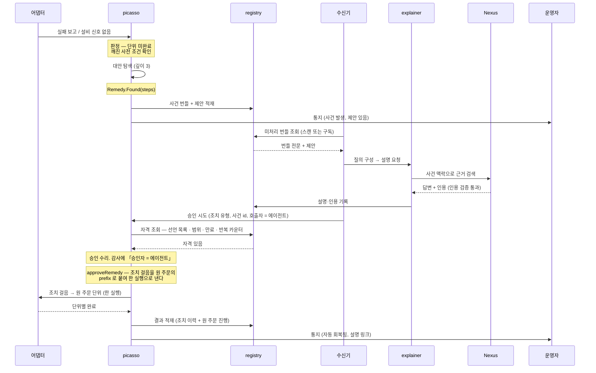
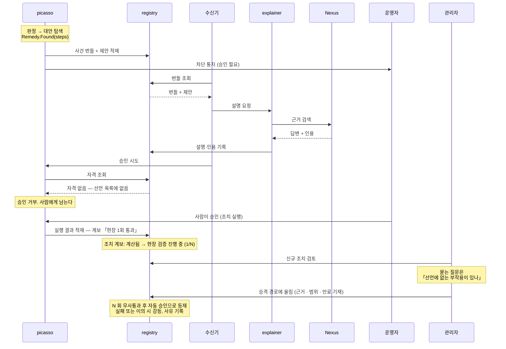
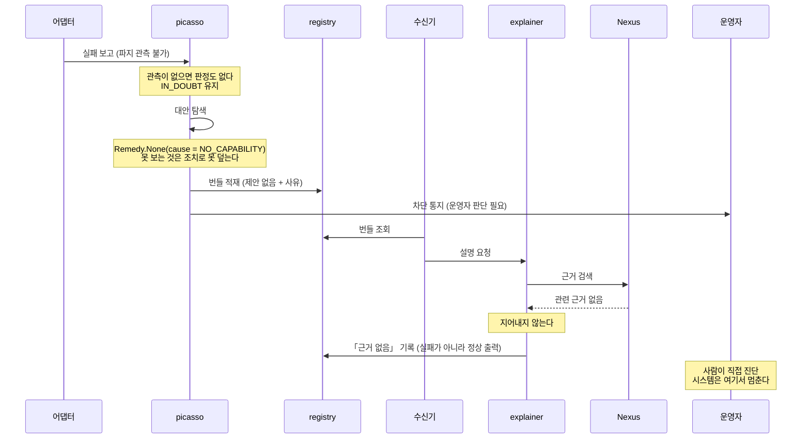
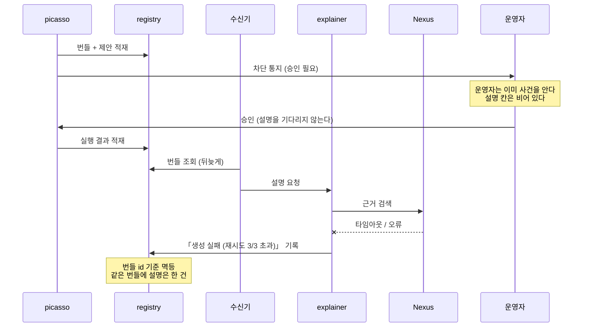
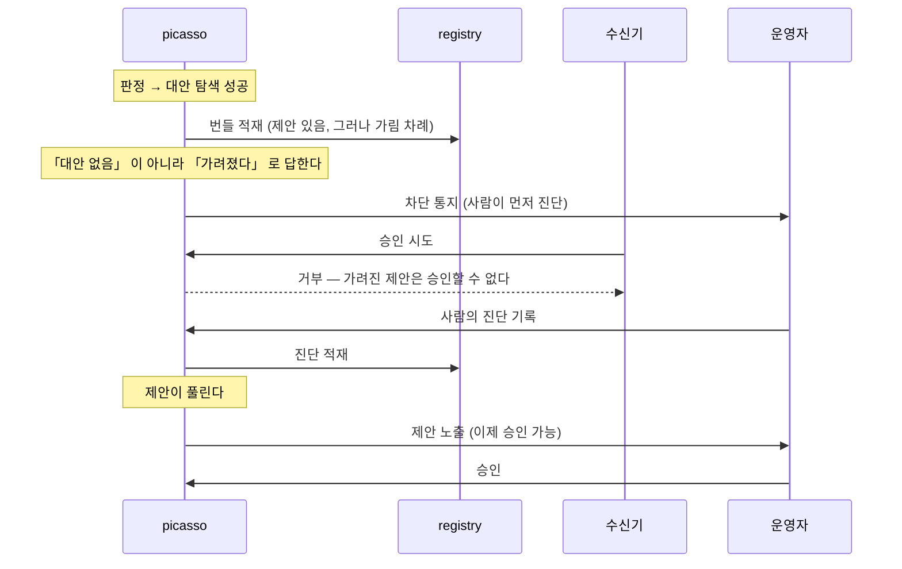
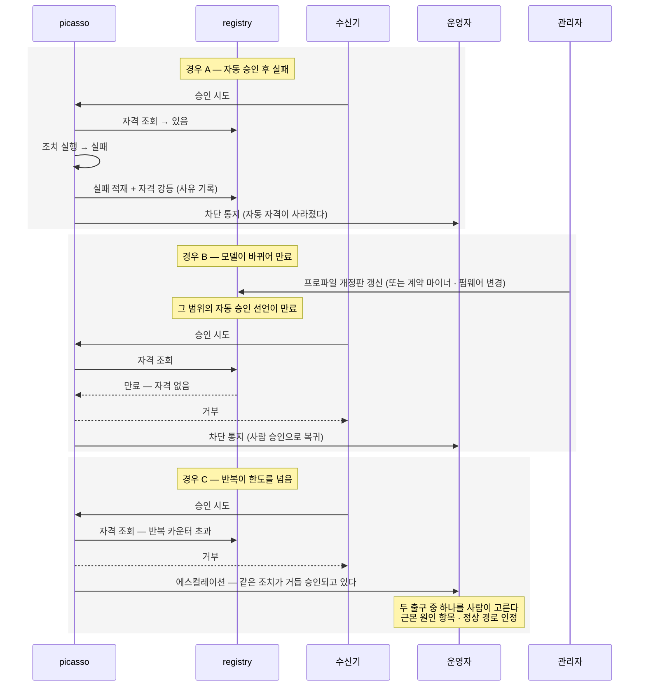

# 02 — 배선 설계

- 대상: `picasso` 와 `picasso-narrator` 를 구현하는 코딩 에이전트 · 작성 2026-09-17
- 원칙과 어휘는 `AGENT-01-맥락과-원칙.md`. 작업은 저장소별로 `AGENT-03`(picasso) · `AGENT-04`(설명 층) · `AGENT-05`(Khala), 붙였을 때의 시험은 `AGENT-06`
- **파트 A 는 picasso 담당이, 파트 B·C 는 설명 층 담당이 정본으로 쓴다.** 다만 경계 규칙(호출 방향, 자격 판정의 위치)은 **양쪽이 다 읽는다** — 둘 사이의 규칙이라 한쪽만 알면 지켜지지 않는다
- 관련 기록(저장소 안): `ADR 38` 미션 계층 내재화 · `ADR 9` 소비자 존재 원칙 · `ADR 40` 질의이고 계약이 아니다

**이 문서의 목적**: 전역 배차·경로·교통을 "범위 밖"으로 배제하지 않고 **아키텍처의 일원으로 배선한다.** 구현체가 없어도 자리, 포트, 소유자, 인계 지점, 승격 경로를 확정한다.

**원칙**: **안 만든 것도 자리는 있어야 한다.** 자리가 없으면 나중에 누군가 우회로 붙이고, 그 우회가 사고 경로가 된다.

| 파트 | 내용 |
|---|---|
| **A** | picasso 배선 — 세 층, 자원 소유, 셀 경계, 배선도, 포트, 통로 소유자, 재할당, 지도·자리 |
| **B** | 설명 층 배선 — 조각 넷, 호출 방향, 다룰 수 있는 층, 자동 승인 사다리, 알림 |
| **C** | 운영 경로 시퀀스 여섯 |

---

## 전제 조건

| # | 전제 | 아니면 |
|---|---|---|
| 1 | `AGENT-01` 을 읽었다 | 어휘가 어긋난 채로 설계를 읽게 된다 |
| 2 | 파트 A 를 쓰려면 `picasso` 저장소 접근이 있다 | 배선을 코드와 대조할 수 없다 |
| 3 | 파트 B·C 를 쓰려면 `AGENT-04` 의 전제를 먼저 본다 | 아직 차례가 아니다 |

**이 문서는 작업 지시가 아니라 설계 참조다.** 무엇을 언제 할지는 `AGENT-03`·`04`·`05` 에 있다.

**정본이 옮겨간다.** 파트 A 의 내용은 T0·PR 8 에서 picasso 의 tracked 문서로, 파트 B·C 는 narrator 의 `BOUNDARY.md`·`SEQUENCES.md` 로 이주한다. **이주가 끝난 항목은 저장소 문서가 정본이고 이 문서는 사본이다** — 어긋나면 저장소가 이긴다.

---

# A. picasso 배선

## 1. 오케스트레이션은 한 덩어리가 아니라 세 층이다

| 층 | 무엇을 정하나 | 실패하면 | 소유자 |
|---|---|---|---|
| **L1 작업 오케스트레이션** | 무엇을 언제 누구에게 — 재할당·우선순위 | 느리거나 나쁜 답(처리량 손실·특정 셀 기아) | 정책 계산. 안이든 밖이든 **결정권 없음** |
| **L2 실행 보증** | 그게 실제로 됐는지, 안 됐으면 무엇을 아는지 | **거짓을 참으로 단정** | **picasso** (ADR 38 이 내재화) |
| **L3 경로·교통** | 물리적으로 어떻게 가는지, 누가 바닥을 쓰는지 | 충돌·교착 | 자원 소유자 — 플릿, 또는 조정층 |

두 방향의 의존이 있다.

- **L1 은 L2 없이 성립하지 않는다.** "실시간 상태 기반 작업 할당"의 전제는 상태가 참이라는 것이다. 상태를 믿을 수 없으면 L1 은 쓰레기를 최적화한다
- **L3 은 L2 가 대신할 수 없다.** 바닥을 소유하지 않으므로, 사본을 들고 와도 그 값을 참으로 유지할 권한이 오지 않는다

ADR 38 은 L2 를 안으로 끌어온 결정이고, 밖에 남긴 것은 L3(전역 라우팅)이다. **L1 은 배제된 적이 없다** — 셀 내 L1 은 범위 안이고 미구현이다.

---

## 2. 자원 소유 대장 — 빈 칸이 무승인 경로다

| 자원 | 소유자 | 관문(승인 지점) | 현재 |
|---|---|---|---|
| 셀 내 기체의 작업 배정 | picasso | `submit` → `chainViolation` · `liveHold(robotId)` | **있음** |
| 셀 내 슬롯·지그·버퍼 점유 | picasso | — | **미구현** (점유 축 부재) |
| 셀 내 작업 공간(반경 겹침) | picasso | — | **미구현** (공간 축 부재) |
| AMR 개체와 이송 | 플릿 | `AmrFleetPort.dispatch` — `null` 이 거절 | **있음** |
| 통로·층 점유 (AMR) | 플릿 | 플릿 내부 | 있음(플릿 것) |
| **통로·층 점유 (걷는 기체)** | **없음** | **없음** | **구멍 — §6** |
| 상류 작업 순서 | MES | MES 쪽 | 있음 |
| 자리 이름 ↔ 좌표 바인딩 | 정본(Yggdrasil 계열) | 활성 버전 확인, 미확인 시 차단 | **미구현** (M1·M2) |

**규칙 둘.**

1. **자원 하나에 소유자는 하나.** 겹치면 우선순위 규칙을 더하지 않고 소유를 다시 긋는다
2. **소유자 없는 자원에는 명령을 내지 않는다** — deny by default. 자격은 선언으로만 생긴다(자동 승인 선언 목록과 같은 형태)

이 표가 **현장 도입의 첫 작업**이다. 자원을 열거하고 소유자를 적고 빈 칸을 찾는다. 빈 칸이 사고가 나는 자리다.

---

## 3. 경계를 어디에 긋는가 — 네 조건이 겹치는 선

"워크셀"은 관습적 단위라서 경계가 아니다. 그 선에서 서로 다른 넷이 동시에 일치하기 때문에 경계다.

1. **멈출 수 있는 범위와 같다** — 셀은 안전 회로의 배선 단위(도어 스위치·라이트 커튼·정지 구역). 보증이 깨졌을 때 멈출 수 없으면 보증은 무의미하므로, **보증 범위는 정지 범위보다 클 수 없다**
2. **증거가 닿는 범위와 같다** — E2 의 원천(인계 설비·검증 센서·셀 PLC)이 셀에 속한다. 판정 가능 범위 = 증거 도달 범위
3. **책임이 넘어가는 지점과 같다** — 경계에 물리적 인계대가 있다. "누가 책임자냐"가 **물건의 물리적 위치로** 결정되고 협의가 필요 없어진다
4. **시간 규모가 균일한 범위와 같다** — 셀 내부는 초·서브초, 셀 간은 분 단위. 하나의 결정적 tick 으로 다룰 수 있는 범위다

**검증은 경계를 옮겨 보는 것이다.** 크게 잡으면 증거가 닿지 않는 곳을 보증하게 되고(2 위반), 작게 잡으면 인계 지점이 내부로 들어와 한 물건에 소유자가 둘이 된다(3 위반).

**셀이 없는 라인에서는** 벽이 경계가 아니다. 위 네 조건으로 경계를 다시 계산한다 — 인터록이 걸리는 범위와 증거가 닿는 범위. 셀은 네 조건이 흔히 잘 겹치는 형태일 뿐이다.

---

## 4. 배선도

점선은 **아직 없는 것**이다. 자리와 방향만 확정해 둔다.

**읽는 법 셋.**

- **관문을 지나지 않는 화살표는 없어야 한다.** `DISP → ROB` 같은 선이 그려질 수 있으면 그게 미들웨어 우회다
- **picasso 는 설명 층을 호출하지 않는다.** outbox 에 적고 끝낸다 — 소비자에게 의존하면 소비자가 죽을 때 사건 처리가 멈춘다
- **프레임과 좌표는 어댑터에서만 나타난다.** 공통 계층은 이름만 안다

---

## 5. 포트 대장

| 포트 | 방향 | 계약 형태 | 증거 | 상태 |
|---|---|---|---|---|
| `RobotPort` | picasso → 로봇 | `start`/`watch`/`cancel`/`snapshot`/`replay`. 당기는 모양 | E0 | 있음 |
| `CellSignals` | picasso → 설비 | `observe(location)`. 신호 없음은 `null`(빈 자리가 아니라 **말이 없다**) | E2 | 있음 |
| `AmrFleetPort` | picasso → 플릿 | `dispatch(TransportOrder)` → 핸들 또는 `null`. **통로를 요청하지 않는다 — 결과를 요청한다** | E1 | 있음 |
| 상류 ack | picasso → MES | `upstream_ack` | E3 | 있음 |
| **배정 제안 포트** | L1 → picasso | 순위 목록을 받는다. picasso 는 위에서부터 첫 통과를 채택. 전부 떨어지면 **미배정으로 남긴다** | — | **미구현(이번)** |
| **점유 포트** | picasso 내부 | 슬롯·지그·공간의 점유 조회·예약. 유효 기간 있음 | — | **미구현(이번)** |
| **구간 예약 포트** | picasso ↔ 조정층 | 요청·거절·유효 기간. 무응답을 성공으로도 실패로도 해석하지 않음 | — | **자리만** |
| **바인딩 조회** | 어댑터 → 정본 | 이름 → (기종, `mapId`, 식별자 또는 좌표+프레임). 활성 버전 미확인 시 해석하지 않고 거절 | — | **미구현(M1·M2)** |
| **자격 조회** | picasso → 선언 목록 | 조치 유형·범위·만료·반복 카운터를 묻는다. 불변식 2 가 이 포트에 걸려 있다 | — | **미구현 · 자리 미결.** §C 시퀀스 1·2·6 이 이미 쓰는데 이 대장에 없었다(9/17). `picasso` 의 프로젝트 의존은 `contracts`·`capability`·`client` 뿐이고 `src/main` 에 `registry` 문자열이 0건이다 |

**계약의 공통 규칙 넷.**

- 요청은 **거절될 수 있다**. 거절은 정상 경로다
- 빌린 권한에는 **유효 기간**이 있다. 기간이 끝나면 다시 요청하거나 손을 놓는다
- **무응답은 성공도 실패도 아니다** — `IN_DOUBT`. 재전송은 조회가 가능한 하류에서만, 아니면 운영자
- 거부 이유는 **이미 있는 어휘로만** 돌려준다(`PRECONDITION_UNMET`, 걸린 hold). 새 이유 코드를 늘리면 내부 판정 규칙이 계약으로 새어 나간다

---

## 6. 통로의 소유자 — 만든다. 무소유는 결함이다

걷는 기체가 셀을 나가면 그 바닥의 소유자가 없다. 플릿은 자기 AMR 만 승인하므로, picasso 가 내는 명령이 **아무 관문도 통과하지 않고** 물리 세계로 나간다.

선택지는 둘뿐이다 — **소유자를 만들거나, 그 자원을 쓰지 않거나.** 무승인 통행을 허용하는 셋째는 없다. 그러므로 그때까지의 올바른 상태는 **소유자 없는 구역에 명령을 내지 않는 것**이다.

소유자를 만드는 방법, 권고 순서대로.

| | 방법 | 얻는 것 | 대가 |
|---|---|---|---|
| **D** | **물리로 분리한다** — 통로를 겹치지 않게 깐다 | 문제가 발생하지 않는다. 소프트웨어 0 | 공간·레이아웃 제약 |
| **C** | **구역을 잘라 기존 소유자에게 배정한다** | 새 시스템 없음. 기존 관문 재사용 | 구간 경계가 또 하나의 인계 지점 |
| **B** | **상위 조정층(RMF 류)을 둔다** | 다벤더 전제의 표준적 해법. 기종 간 계산 가능 | 시스템 하나 증가. 새 단일 장애점·무한 책임 후보 |
| **A** | **플릿 벤더가 걷는 기체까지 품는다** | 교통 로직과 지도가 이미 있다 | 벤더 종속. 타사 기체를 받을 이유가 벤더에 없다 |

**핵심: 소유자 신설은 시스템 신설이 아니다.** 소유자를 정하는 일의 정체는 *"누가 그 자원의 값을 참으로 유지할 수 있는가"* 를 정하는 것이다. 구간을 잘라 기존 소유자에게 주면 시스템이 하나도 늘지 않고 소유자가 생긴다. 그래서 C 가 B 보다 먼저다.

**승격 트리거를 미리 적어둔다.** 겹치는 구간이 셋을 넘거나, 바닥을 공유하는 벤더가 셋 이상이 되면 C → B 로 올린다. 조건을 먼저 적어 두면 나중에 즉흥적으로 결정되지 않는다.

**picasso 가 구간 소유자가 되는 경우**(C)에는 그 구간의 **예약 관문**을 내놓는다 — 요청받고, 거절할 수 있고, 유효 기간이 있는 것. 플릿이 그 구간을 쓸 때 picasso 의 승인을 받는다. 이것이 무한 책임 프록시와 다른 점은 하나다 — **소유한 것만 승인한다.** 소유하지 않은 옆 구간의 요청을 대신 받으면 그때 프록시가 된다.

---

## 7. 셀 내 재할당의 배선 — 이번에 만드는 것

**붙는 자리**: `JobOrder` → `ExecutionUnit` 분해 **뒤**, 하달 **직전**의 배정 단계. 재할당 트리거는 **이미 있는 사건 번들이 생기는 그 자리**다(실패 판정·깨진 전제·잔여 파지가 곧 입력).

**이미 준비된 것**: 사전 조건과 효과가 선언에 들어와 있으므로 "이 기체가 이 단위를 받을 수 있나"는 계산된다. 관문(`chainViolation`·`liveHold`)도 이미 있다.

**추가할 것 셋.**

1. **자원 상태 축** — 지금은 파지 하나(4값)뿐이다. 슬롯·지그·버퍼 점유와 **작업 공간 점유**를 축으로 올린다. 이 축이 없으면 "자재 결품 → 다른 슬롯"이 계산되지 않고, 두 기체의 반경 겹침도 판정할 수 없다
2. **비용 함수** — 처음부터 **설정으로 받는다**. 정책은 데이터로 밖에, 평가는 안에서. **⚠ 자리 미결(9/17)** — 여기는 «자동 승인 선언 목록을 설정 파일에 둔 것과 같은 모양» 이라 적었고 §B5 는 «선언이 있을 자리는 프로파일이 아니라 `registry` 다» 라고 적었다. **둘 다 아직 없는 것이라 어느 쪽도 선례가 아니다.** 실재하는 선례는 생성자 인자 `withholdEvery` 하나다 — 기본값을 두지 않고 배치가 명시하는 모양. 그리고 `picasso` 모듈은 `profile/` 을 직접 읽지 않고(프로파일 사실은 포트로 들어온다) `registry` 를 의존하지도 않는다
3. **진동 방지** — 히스테리시스와 최소 유지 시간. 재할당이 라인을 멈추지 않는지가 최적성보다 우선한다

**관문의 세 규칙**(경계가 부풀지 않게 하는 장치).

- 관문은 **아무것도 고르지 않는다.** 순수 술어다 — 통과/거부와 이유만 낸다. 고르기 시작하면 그건 배정기다
- 제안은 **순위 목록**으로 받고 위에서부터 첫 통과를 채택한다. 순서는 배정기 것
- 전부 떨어지면 **미배정으로 남긴다.** 재계산을 요청하면 picasso 가 중재자가 된다

**왜 지금은 안에 두는가**: 셀 하나에 기체 몇 대인 규모에서 프로세스로 빼는 것은 과설계다. 그리고 안쪽이 안전한 이유는 빠르기가 아니라 **단일 적용자**다 — 외부 사건은 도착 즉시 상태를 바꾸지 않고 큐에 들어가 tick 경계에서 적용되므로, 읽은 스냅샷과 결정을 적용하는 스냅샷이 같다. 밖으로 빼면 "읽은 시점 → 결정 도착 시점"의 창이 생기고, 그 창은 통신 지연이 아니라 **읽는 자와 쓰는 자가 다르기 때문에** 생긴다(같은 프로세스에서 스레드만 나눠도 남는다).

**밖으로 빼는 조건**: 비용 함수가 현장마다 주 단위로 바뀌기 시작하면 릴리스 주기가 충돌한다. 그때 배정기를 프로세스로 빼고, 위 세 규칙이 그대로 프로토콜이 된다.

---

## 8. 지도·자리의 배선 (M1 · M2)

**picasso 는 좌표를 모른다. 의도된 것이다.** `location` 은 문자열이고 `DeliverContainer` 에 *"상류는 어느 AMR 을 쓸지도 경로도 지정하지 않는다"* 고 적혀 있다.

**M1 — 자리 바인딩 표.** (자리 이름, 소유 시스템, 그 시스템의 식별자 **또는** 좌표+프레임, 기준 지도 버전). **어댑터만** 읽는다. 공통 계층이 그 타입을 참조하면 CI 가 실패한다(기종 비인지 검사의 연장).

**ADR 34 와 충돌하지 않는다(9/17 확인).** ADR 34 §2 의 금지는 *"어댑터가 **소유**하지 않는다"* 이고 근거 셋이 전부 *"어댑터 **내부에 보관**하면"* 이다 — 읽는 것을 금지한 문장이 없다. 그리고 §4 결론이 소유자로 **상위 사이트 레지스트리를 명시 허용**한다. §2 대장이 적은 `정본(Yggdrasil 계열)` 이 그것이다. ADR 35 와는 긴장이 있으나 모순이 아니다 — **정본은 기체의 경쟁 사본이 아니라 기체를 가르친 원본**이고, 아래 「파생은 단방향」이 역류를 막는다.

**그러나 좌표 열은 담보가 아니다.** 저장소 전체에 좌표·프레임·pose 개념이 하나도 없다 — 계약의 `location` 은 `is_site_reference = true` 인 문자열이고 `skill_catalog.proto:166` 에 *"좌표가 아니다"* 라고 적혀 있다. 미믹에 기하가 없으니 **좌표 바인딩을 틀리게 만들 방법이 없다.** 아래에서 datum 등록을 미루며 쓴 문장이 그대로 적용된다 — *"항상 통과하는 시험은 아무것도 보증하지 않는다."* 소비자도 없다(ADR 9) — 어댑터의 벤더 값 변환은 ADR 35 경로가 이미 하고, 표시 경로의 첫 소비자는 아래에서 스스로 미뤘다.

**그래서 열은 두고 담보로 적지 않는다.** 저장소가 그 처리를 이미 정해 뒀다 — *"검증 테스트가 연결되지 않은 인터페이스 담보는 보증된 사양으로 간주하지 않는다"*(`CLAUDE.md` §3). 담보는 **자리 이름 · 소유 시스템 · 기준 버전** 셋이고, **식별자 · 좌표+프레임** 은 열만 두고 한계 대장에 «실물 두 기종이 붙을 때» 로 올린다.

**M2 — 지도·캘리브레이션 버전 무효화.** 바인딩의 기준 버전이 활성 버전과 다르면 **자리를 해석하지 않고 거절**한다(`PRECONDITION_UNMET`). 지도 버전과 **개체 캘리브레이션 버전** 두 축 모두. 물리 오차를 다루지 않고 판정 로직만이라 시뮬에서도 진짜로 검증된다.

**두 표준의 방법론을 경로별로 나눠 쓴다.**

| | VDA 5050 | Open-RMF |
|---|---|---|
| 공통 좌표계 | 없다. 지도마다 좌표 + `mapId` | 있다. RMF 좌표가 정본 |
| 변환 | 표준 밖. 상위는 **좌표 표**만 갖는다 | fleet adapter 가 대응점 쌍으로 맞춤(`nudged`) |
| 어긋남 감지 | `mapId`·`mapVersion` 불일치 | 대응점 잔차 |
| 기종 간 거리 계산 | 불가 | 가능 |

**판정은 VDA 식**(이름 + 기준 지도, 어긋나면 차단 — 변환 오류가 판정에 들어올 자리가 없다), **표시는 RMF 식**(공통 좌표 + 대응점 변환, 잔차를 신뢰도로 표시).

**일을 두 번 하지 않는다.** 바인딩 표의 같은 자리 이름 행들이 그대로 대응점 쌍이다. 티칭은 한 번이고 산출물의 용도가 둘이다. 추가되는 것은 공통 좌표계를 무엇으로 할지 정하는 것뿐이고, **기종 하나를 기준으로 삼으면 비용이 0**이다.

**파생은 단방향이다.** 표 → 변환. 역방향(변환으로 계산한 좌표를 표에 써넣기)은 금지 — 계산값이 정본에 섞이면 결국 판정 근거로 승격된다. 그리고 표가 정본이므로 M2 의 무효화가 표시 경로까지 자동으로 전파된다.

**안 만드는 것 둘과 이유.**

- **프레임 명시 pose 계약** — 지금 pose 를 읽는 소비자가 없다(ADR 9). **통합 화면이 첫 정당한 소비자**이고, 그때 최소 표시면과 계약을 **같은 PR** 에 넣는다
- **현장 기준점(datum) 등록** — 시뮬레이션은 좌표계가 하나라 틀리게 만들 방법이 없다. 항상 통과하는 시험은 아무것도 보증하지 않는다. 실물 두 기종이 붙을 때

**가르는 기준 한 줄**: **판정 로직만인 것은 지금 만들고, 물리가 본질인 것은 실물이 붙을 때 만든다.**

---

## 9. 정직 대장 — 구현 / 선언만 / 미구현

| | 항목 |
|---|---|
| **구현** | 상태 보증(2축 + `upstream_ack`), 증거 등급 E0–E3, 시간창 검증, `IN_DOUBT` 해소 순서, 배정 관문(`chainViolation`·`liveHold`), 사전 조건·효과, 대안 탐색(깊이 3), 사건 번들, 플릿 위임(`AmrFleetPort`), 어댑터 4종, 게이트 검사 8종 |
| **선언만 있음 (자리는 있고 구현은 없음)** | 구간 예약 포트, 조정층 접점, 정량 사전 조건(적재 질량·무게중심 — 관측하는 어댑터가 없다) |
| **미구현 (이번 범위)** | 셀 내 자원 점유 축(슬롯·지그·**공간**), 비용 함수, 진동 방지, 배정 제안 포트, 자리 바인딩 표(M1), 버전 무효화(M2) |
| **미구현 (범위 밖 — 소유자가 다르다)** | 전역 배차·라우팅, 통로 교통 조정, 기능안전 기능 |
| **구멍 (소유자 미정)** | 걷는 기체의 통로·바닥. §6 의 D→C→B→A 로 정한다 |

---

## 10. 확인할 질문

- 플릿이 **자리 이름**을 외부에 노출합니까, 아니면 좌표만 받습니까
- 플릿이 **구역·노드 잠금**이나 **I/O·PLC 연동 접점**을 제공합니까
- 현장 **기준점과 측량 기준**이 정의되어 있습니까 — 기종이 다른 로봇들이 같은 자리를 어떻게 맞춥니까
- **지도가 갱신될 때 통보**됩니까, 아니면 조용히 바뀝니까
- **로봇 개체를 교체하면** 상위에 통보됩니까, 아니면 같은 이름으로 조용히 바뀝니까
- 작업 순서 권한이 MES 에 있는데 오케스트레이터가 재할당하면 **누가 이깁니까**
- 걷는 기체가 통로를 쓸 때 **그 바닥의 소유자는 누구입니까** — 정해져 있습니까

---

# B. 설명 층(narrator)의 배선

`picasso-narrator` 는 **사건 번들을 읽어 원인 설명과 검증된 근거 인용을 내놓는 층**이다. picasso 의 소비자이며, **picasso 는 이 저장소의 존재를 모른다.**

## B1. 하는 일과 하지 않는 일

| 한다 | 내용 |
|---|---|
| 번역 | 번들의 사실을 운영자가 읽을 문장으로. **판정이 아니라 번역이다** |
| 근거 검색과 인용 | 코퍼스에서 찾아 붙인다. 인용의 검증은 Nexus 가 한다 |
| 후보 원인의 정렬 | 번들만으로 좁혀지지 않을 때. **이것만이 실질 판단이고 제안이지 판정이 아니다** |
| 자동 승인 시도 | 탐색기가 낸 조치에 대해 승인 API 를 부른다. **허락 여부는 picasso 가 정한다** |

| 하지 않는다 | 이유 |
|---|---|
| 상태 판정 | 결정적 층의 몫. 번들이 이미 판정을 담고 있다 |
| 대안 생성 | 탐색기의 몫. 여기는 탐색 결과를 설명한다 |
| 직접 명령 | 명령 원천이 둘이 되면 미들웨어가 권위가 아니라 참가자로 떨어진다 |
| 알림 등급 결정 | 판정이 등급을 정하고, 여기는 그 알림에 실릴 문장만 쓴다 |
| 감시·탐지 | 직접 보면 같은 사건에 두 개의 진실이 생긴다 |
| **자격 자체 판단** | 선언 목록 대조는 승인 API 의 몫. 여기서 판단하면 우회가 가능하다 |

## B2. 조각은 넷이고 LLM 은 하나다

| 조각 | 하는 일 | LLM |
|---|---|---|
| **수신기** (`receiver`) | 새 번들이 생겼는지 보고 집어온다. 멱등 처리·재시도·실패 기록 | 없음 |
| **질의 구성** (`composer`) | 번들의 필드에서 검색 질의와 입력을 만든다 | 없음 |
| **설명 생성** (`explainer`) | Nexus 에 질문을 던지고 답과 인용을 받는다 | **여기만** |
| **기록기** (`recorder`) | 설명과 인용, 또는 「근거 없음」, 또는 「생성 실패」를 사건에 붙인다 | 없음 |

**자율 루프가 아니다.** LLM 이 하는 일은 사건당 한 번의 질의-응답이고, 도구 호출은 Nexus 내부 검색뿐이다. 목표를 향해 도구를 고르며 반복하는 루프는 v1 에 없다 — 넣으려면 조회 횟수와 비용 상한이 먼저 필요하고, 그때 이 문서를 고친다.

## B3. 호출 방향 — picasso 가 부르지 않는다

부르면 자기 소비자에 의존하게 되고, 설명 층이 죽을 때 사건 처리가 멈춘다. 배선은 이렇다.

1. picasso 가 번들을 **레지스트리에 적재**한다 — 권위 있는 기록
2. 알림이 필요하면 **발행**한다 — picasso 는 누가 듣는지 모른다
3. 수신기가 **구독**하고, 전문은 적재분에서 읽는다
4. 발행을 놓치면 **적재분을 스캔해 따라잡는다**

**발행은 알림이고 적재가 권위다.** v1 은 발행 없이 적재 + 주기 스캔만으로 시작한다 — picasso 쪽 변경이 그만큼 작아지고, 지연이 초 단위로 늘어나는 것은 설명 층에서 문제가 되지 않는다.

트리거는 세 갈래다 — 사건 발생 시(설명 하나), 운영자 질의 시(대화형), 교대 종료 시(패턴 요약).

**시간축.** `t0` 실패 보고 또는 신호 없음 → `t0+δ` picasso 판정·번들 적재·**운영자 화면에 사건 등장** → `t0+δ+ε` 수신기 인지 → +수초 설명 생성·인용 검증 → 기록기가 「설명」 칸을 채운다. **운영자는 `t0+δ` 에 이미 안다.** 승인도 설명을 기다리지 않는다.

**멱등과 실패 구별.** 번들 id 기준 멱등이며 사건당 설명 한 건이다. 설명이 없는 이유 셋을 구별해 기록한다 — 「아직 오지 않음」·「생성 실패(재시도 상한 초과)」·「근거 없음」. **「근거 없음」 은 실패가 아니라 정상 출력이다.**

## B4. 다룰 수 있는 층

| 다룰 수 있다 | 다룰 수 없다 |
|---|---|
| 계약 층의 실패 — 사전 조건 위반, 거절 코드, 멱등 충돌 | 로봇 내부 — 관절 제어, 모션 플래닝, 인식 실패의 물리적 원인 |
| 판정 층 — 완료 판정, 효과-관측 어긋남, 미결, 근거 등급 부족 | 설비·PLC 내부 — 센서 값과 래더 논리 |
| 어댑터 경계에서 관측된 것 — 벤더 거절 분류, 관측 불가 | 전역 라우팅·배차, 네트워크·인프라, 안전 계통의 판단 |

**"이 층에서는 여기까지 보이고 그 아래는 다른 자료가 필요하다"가 정답이다** — 회피가 아니라 에스컬레이션 대상을 지목하는 답이다. 층을 넘어 추측하기 시작하면 그것이 이 경계가 막으려던 실패다.

## B5. 자동 승인 — 사다리와 심사

회복은 **picasso 가 실행한다.** 설명 층의 권한은 **승인 한 번**에 그치고, 조치 내용은 탐색기가 만든 것이다.

| 권한 | 범위 |
|---|---|
| 읽기 — 설명 생성, 근거 인용 | 항상 |
| 자동 승인 — 탐색기가 낸 조치를 사람 대신 승인 | **선언 목록에 있을 때만.** 감사 필수 |
| 직접 명령 | 없음 |

감사에 **승인자가 사람인지 에이전트인지** 남긴다. 에이전트 승인의 이의율은 사람 승인과 **따로** 집계한다.

**선언의 성질.** 조치 유형 단위로 범위(셀·기종·스킬)를 붙여 사람이 선언하고, 근거(누가·무엇을 근거로·언제·어느 프로파일 개정판과 계약 버전)가 함께 붙는다. 런타임은 **선언 목록에 있는가만** 본다. 선언은 만료된다 — 프로파일 개정판 변경, 계약 마이너 변경, 벤더 펌웨어 변경, 또는 기간. **선언이 있을 자리는 프로파일이 아니라 `registry` 다** — 프로파일은 기종의 사실이고 자동 승인 허용은 현장 정책이다. **⚠ §7 이 같은 목록을 「설정 파일」로 적었다(9/17). 자리는 미결이고 PR 4·6 과 `AGENT-06` G2 가 전부 여기에 걸려 있다.**

**선언을 승인할 때 사람이 확인하는 기준 넷**(런타임에 계산하지 않는다): 가역성 · 관측 가능성 · 영향 범위 · 결정성(**조치 선택에 LLM 판단이 개입하면 자격 없음**).

**계보 네 칸 — 건너뛰지 않는다.** 계산됨 → 시뮬 검증됨(미믹 재생 통과) → 현장 검증됨(사람 승인 N 회 + 이의 없음) → 자동 승인(선언 등재). **관리자 승인의 의미는 "자동화"가 아니라 "승격 경로에 올림"이다.** 한 번이라도 실패하거나 이의가 붙으면 강등되고 사유가 남는다.

**검토 화면이 묻는 질문은 "이 조치가 목표를 달성하나"가 아니다** — 그것은 탐색기가 계산했다. **"선언에 없는 부작용이 있나"** 가 사람이 답할 질문이다. 이 질문을 묻지 않으면 검토는 의례가 된다.

**반복 승인의 두 출구.** 증상을 우회하는 조치라면 **근본 원인 항목으로**, 설계된 정상 복구 경로라면 **자동 승인 선언 후보로**. **어느 쪽인지는 시스템이 판정할 수 없다** — 시스템이 정하게 하면 우회가 자동화된다. 시스템은 후보를 제시하고 사람이 출구를 선언한다.

**v1 의 상태**: 경로와 자격 검사와 감사를 만들고, **켜는 것은 설정으로 두며 기본값은 끔**이다.

## B6. 알림

| 차단 — 사람이 답해야 진행 | 통지 — 알고만 있으면 됨 |
|---|---|
| 운영자 판단 상태 · 승인이 필요한 대안 · 대안 없음 + 라인 정지 중 · 안전 정지 후 복구 · 의도적 비자동화로 가려둔 사건 | 자동 회복된 일시 실패(개별이 아니라 건수) · 다른 기체로 진행 중인 사건 · 교대 요약 |

둘을 섞으면 알림 피로가 오고 둘 다 무시된다.

**패턴 에스컬레이션**: 같은 대안의 반복 승인 → 근본 원인 미해결 · 이의율 상승 → 원인 지목이 어긋나기 시작 · 근거 없음 비율 상승 → 코퍼스가 낡았다 · 모델 밖 사건율 상승 → 능력 모델 갱신 소환 · **이의율이 0 으로 수렴 → 아무도 안 읽는다.** 마지막이 역설적이지만 제일 중요하다 — 지표가 좋아 보이는 방향으로 움직이는데 감시가 죽은 상태다.

## B7. 설명 층의 한계

상태 축이 파지 하나라 **설명 층이 두꺼워져도 탐색은 깊어지지 않는다**(PR 5 가 이것을 건드린다) · 사후 대조 경로가 없다(§15.147) · 이해 밀도 계량이 없다(§15.151) · 코퍼스의 SOP 가 합성이다 · 평가 규모가 데모(시나리오 여섯 종)다.

---

# C. 운영 경로 시퀀스 — 여섯 가지

참가자 표기: **어댑터**(로봇 한 쌍) · **picasso**(미들웨어) · **registry**(적재·현장 정책) · **수신기**·**explainer**(설명 층의 두 조각) · **Nexus** · **운영자** · **관리자**

## 읽는 방법 — 세 가지 불변식

세 다이어그램 모두 아래를 지킨다. 지키지 않는 배선이 보이면 그것이 결함이다.

1. **picasso 는 narrator 를 호출하지 않는다.** 적재하고, 수신기가 집어온다
2. **자격은 승인 API 가 판정한다.** narrator 는 승인을 *시도*하고, picasso 가 호출자 신원과 선언 목록을 대조해 허락하거나 거부한다. narrator 가 스스로 자격을 판단하면 우회가 가능해진다
3. **설명은 사건 처리의 앞이 아니라 옆이다.** 설명이 없어도 운영자는 사건을 알고 승인할 수 있다

---

## 1. 알려진 조치로 자동 회복 — 자격이 선언돼 있는 경우

**증명하는 것.** 회복이 narrator 의 실행이 아니라 **picasso 의 실행**이라는 것. narrator 가 보낸 것은 승인 한 번이고, 자격 판정은 picasso 가 registry 의 선언 목록으로 한다. 운영자는 두 번 통지받는다 — 사건 발생 시 한 번, 자동 회복 후 한 번. 차단은 없다.

**「막혀 있던 원 주문」이라는 상태는 이 층에 없다(9/17 정정).** 거절된 주문은 실행을 만들지 않았으므로 picasso 가 보관하지 않는다 — 승인자가 주문을 **다시 넘긴다**(`approveRemedy(order, robotId, parameters)`). 그리고 조치와 원 주문은 두 번의 하달이 아니라 **한 실행**이다. 이전 판의 그림대로 만들면 없는 보관 상태와 없는 재개 경로를 만들게 된다.

**설명과 승인의 순서는 고정이 아니다.** 위 그림은 설명이 먼저 붙은 경우고, 승인이 먼저 수리돼도 무방하다. 설명은 사건 처리의 전제가 아니다(불변식 3).

---

## 2. 신규 조치 제안 — 아무도 실행한 적 없는 경우

**증명하는 것.** 관리자 승인이 **자동화가 아니라 승격 경로에 올림**이라는 것. 신규 조치는 관리자가 봐도 바로 자동 승인이 되지 않고, 현장 N 회를 거친다. 그리고 관리자 검토의 질문이 "목표를 달성하나"가 아니라 "선언에 없는 부작용이 있나"다 — 목표 달성은 탐색기가 이미 계산했다.

**미믹 재생을 끼우는 변형.** 관리자가 검토 전에 그 조치를 에뮬레이터에서 재생해 볼 수 있다. 통과하면 계보가 「시뮬 검증됨」으로 한 칸 오른다. 현장 N 회보다 싼 검증이라 먼저 두는 편이 낫다.

---

## 3. 대안 없음 — 「모른다」가 정상 출력인 경로

**증명하는 것.** 세 가지가 서로 다른 상태로 구별된다는 것 — **대안 없음**(탐색 결과), **근거 없음**(검색 결과), **아직 오지 않음**(설명 미도착). 빈 칸 하나로 접으면 운영자가 셋을 구별하지 못한다. 그리고 `NO_CAPABILITY` 와 `DEPTH_LIMIT` 이 갈리므로 운영자는 "이 기체로는 안 된다"와 "더 찾아보면 있을 수 있다"를 구별한다.

---

## 4. 설명이 늦거나 실패 — 사건 처리는 진행된다

**증명하는 것.** 판정은 결정적이고 설명은 비결정적이라는 비대칭. 설명 경로가 통째로 죽어도 사건은 처리된다. **이 순서가 뒤집혀 설명을 기다려야 화면이 채워지면 그 순간 LLM 이 운영 경로에 들어간 것이다.** 그리고 실패 사유를 기록하므로 운영자가 "아직인가, 실패인가, 근거가 없어서인가"를 구별한다.

---

## 5. 의도적 비자동화 — 사람이 먼저 진단해야 풀린다

**증명하는 것.** 훈련 지분을 시스템이 강제한다는 것. 가림은 **대안 없음으로 위장하지 않는다** — 그러면 사람이 "없구나" 하고 넘어가고 훈련 효과가 0 이 된다. 「가려졌다」로 말하고, 사람의 진단이 기록된 뒤에만 풀린다.

---

## 6. 자격의 강등 — 실패 또는 만료

**증명하는 것.** 자동 자격이 **한 방향으로만 움직이지 않는다**는 것. 올라가는 데는 사람의 선언과 N 회 통과가 필요하고, 내려오는 데는 실패 한 번·모델 변경 한 번·반복 한도 초과 한 번으로 충분하다. 비대칭이 의도적이다.

경우 C 가 특히 중요하다. 반복이 한도를 넘으면 **시스템이 스스로 고발하고 사람에게 출구를 고르게 한다.** 시스템이 출구를 정하면 증상 우회가 자동화된다.

---

## 더 그릴 만한 것 — 이 문서에 없는 경로

- **교대 종료 요약과 사후 검토** — 사람이 읽고 동의·이의를 달고 이의율이 집계되는 경로. 개별 사건이 아니라 묶음이라 시퀀스보다 표가 맞을 수 있다
- **발신자 거절 경로**(§15.150) — 어댑터 호스트가 접수를 거절한 경우. 이 층에 파지 관측이 없어 대안을 계산하지 못하므로, 그림을 그리면 빠진 화살표가 드러난다. 그 자체로 한계의 증거가 된다
- **운영자 질의**(대화형) — 이미 설명이 붙은 사건에 추가 질문을 던지는 경로
