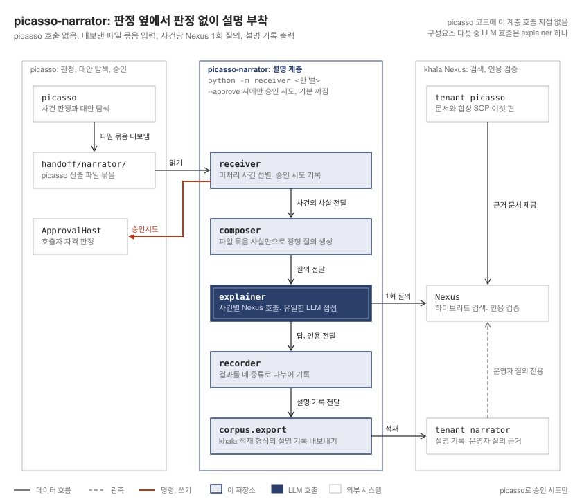
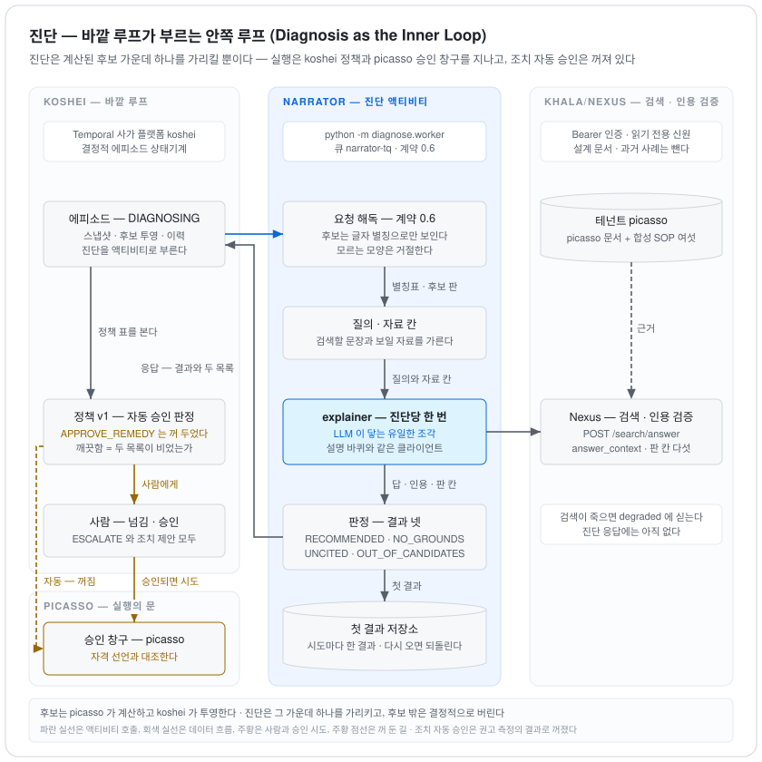
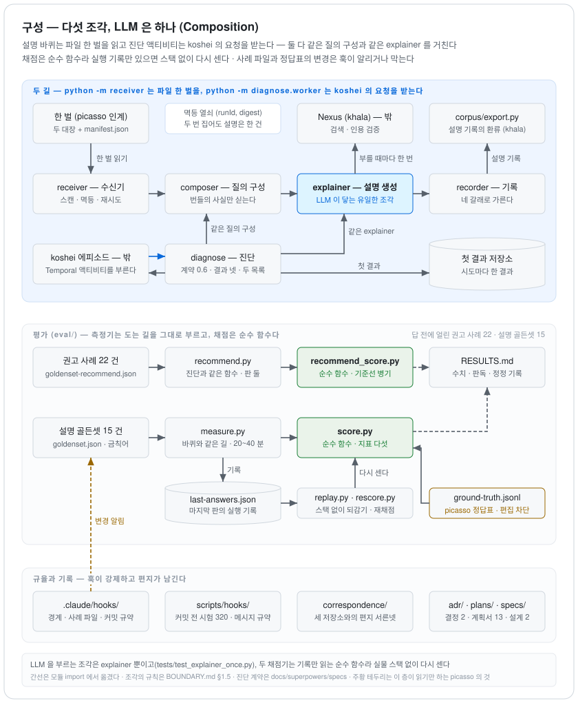
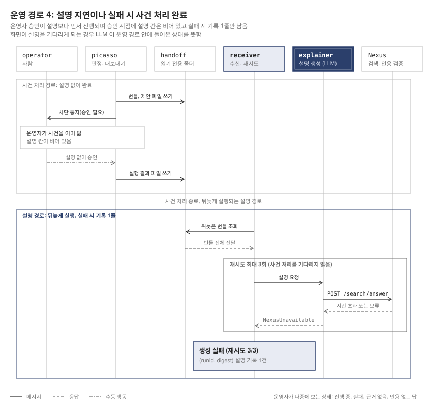
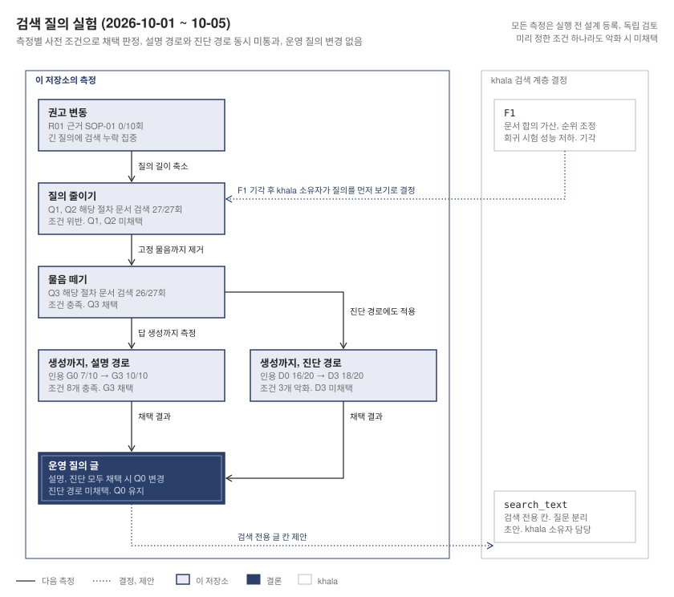

# picasso-narrator — 로봇 미들웨어 사건의 원인 설명 · 대응 권고 및 근거 인용 계층

이기종 로봇 미들웨어 [`picasso`](https://github.com/LivingLikeKrillin/picasso)가 내보내는 **사건 번들(Incident Bundle)**을 읽어 원인 후보의 정렬과 **코드 검증된 근거 인용(Verified Citation)**을 생성하는 LLM 기반 설명 계층 PoC 프로젝트입니다. 바깥 루프인 `koshei`의 에피소드가 부르는 **진단 워커(Diagnosis Worker)**로도 동작하며, 이때는 `picasso`가 계산하고 `koshei`가 투영한 대응 후보 가운데 하나를 가리키고 그 이유를 같은 방식의 검증된 인용으로 제시합니다. 판정과 실행은 결정론적 계층의 책임으로 남기고 계층은 설명과 권고만 담당하며, LLM 의 실패·지연이 사건 처리를 막지 않도록 **별도 저장소 · 호출당 단일 질의**로 경계를 강제합니다. 골든셋 기반 자동 지표와 인간 평가를 병기하고, 권고는 답을 보기 전에 고정한 사례로 재는 **평가 체계**를 함께 제공합니다.

계층은 다음 네 가지 명제를 기반으로 설계되었으며, 문서상의 약속이 아닌 **테스트와 훅의 차단 조건**으로 강제됩니다:

1. **판정은 결정론적이고 설명은 비결정론적이다.** 설명 생성이 실패하거나 지연되어도 사건 처리는 진행되며, 설명이 틀려도 판정은 바뀌지 않습니다. 근거가 없으면 지어내지 않고 「모른다」고 답합니다.
2. **경계는 문서가 아니라 코드 배치로 증명한다.** `picasso`의 LLM 의존성은 0이며 본 저장소의 존재를 알지 못합니다. 본 저장소의 어떤 코드도 `picasso`를 수정하지 않으며, 형제 저장소로의 쓰기는 훅(`.claude/hooks/boundary_guard.py`)이 차단합니다.
3. **자동 승인 자격은 승인 등록으로만 생긴다.** 계층은 자동 승인을 *시도*할 뿐 자동 승인 자격을 판단하지 않습니다. 허락 여부는 `picasso`가 호출자 식별 정보와 승인 등록 목록을 대조하여 판정합니다.
4. **LLM 은 조치를 기술하지 않고 계산된 후보를 가리킨다.** 진단은 후보를 글자 별칭으로만 보고 그 가운데 하나를 고르며, 후보 외 선택을 가리킨 답은 결정적으로 버려집니다(`OUT_OF_CANDIDATES`). 권고를 실행할지는 `koshei` 정책과 `picasso` 자동 승인 자격 등록이 정하며, 조치의 자동 승인은 권고 측정의 결과로 현재 꺼져 있습니다.

<picture>
  <source media="(prefers-color-scheme: dark)" srcset="docs/diagrams/position.dark.svg">
  
</picture>

**설명은 사건 처리의 앞이 아니라 옆에 섭니다.** `picasso`는 판정과 대안 탐색을 마치고 파일 번들을 내보낼 뿐 계층을 호출하지 않으며, 운영자 통지와 승인은 설명을 기다리지 않습니다. 계층은 그 파일을 읽어 사건당 한 번 Nexus 에 묻고, 결과를 설명·인용 / 인용 없는 답변 / 근거 없음 / 생성 실패 넷으로 갈라 기록합니다. `picasso`로 되돌려 보내는 것은 승인 *시도* 하나이며 자동 승인 자격은 `picasso`가 판정합니다. 여섯 운영 경로의 시퀀스는 [`SEQUENCES.md`](SEQUENCES.md)에 있습니다.

<picture>
  <source media="(prefers-color-scheme: dark)" srcset="docs/diagrams/diagnosis.dark.svg">
  
</picture>

**진단은 후보를 가리킬 뿐 실행하지 않습니다.** `koshei`의 에피소드가 DIAGNOSING 상태에서 Temporal 액티비티 `diagnose`(큐 `narrator-tq`)를 부르면, 계층은 요청의 스냅샷 · 후보 · 이력을 해독하여 후보를 글자 별칭으로 바꾸고 설명 경로와 같은 질의 구성과 같은 `explainer`로 Nexus 에 한 번 묻습니다. 검색에 쓰는 글은 질문을 뗀 짧은 검색 텍스트(`search_text`)이고, 질문은 `query`에, 후보 목록 등 모델에게만 보이는 것은 답변 컨텍스트(`answer_context`)에 두므로 후보 목록이 검색을 흐리지 않습니다. 답은 결과 넷(`RECOMMENDED` · `NO_GROUNDS` · `UNCITED` · `OUT_OF_CANDIDATES`)과 두 목록(인용 없는 문장 · 확인 못 한 주장)으로 판정되어 시도마다 한 번만 결과 캐시에 기록되며, `koshei`는 그 결과를 정책 표에 대어 사람에게 넘길지 승인을 시도할지를 정합니다. 계약의 정본은 [진단 계약 초안](docs/superpowers/specs/2026-09-27-진단-계약-초안.md)(버전 0.6)입니다. 시퀀스와, 세 불변식 가운데 진단에는 서지 않는 하나(설명은 옆에 선다)는 [`SEQUENCES.md`](SEQUENCES.md) 「진단 경로」에 있습니다.

> **설계 정본:** 규칙의 정본은 [`BOUNDARY.md`](BOUNDARY.md)이며, 코드보다 먼저 작성되었습니다. 진단 경로의 정본은 위 진단 계약 초안입니다. 본 README는 입문 개요이며 상충하는 내용이 있을 경우 두 문서를 우선합니다. 현재 상태는 [`STATE.md`](STATE.md), 측정 결과는 [`eval/RESULTS.md`](eval/RESULTS.md)에 있습니다.

## 시스템 모듈 구성

<picture>
  <source media="(prefers-color-scheme: dark)" srcset="docs/diagrams/components.dark.svg">
  
</picture>

```
receiver/                 번들(incidents.jsonl · remedy-searches.jsonl · manifest.json)을 읽고 미처리분을 고른다.
                          멱등 · 재시도 · 실패 기록. 승인 시도의 승인 로그. LLM 없음
composer/                 번들과 스냅샷의 사실에서 고정 형식의 질의를 만든다. 번들에 없는 사실을 보태지 않는다. LLM 없음
explainer/                Nexus 에 호출당 한 번 묻고 답과 인용을 받는다 — LLM 이 닿는 유일한 코드 모듈
recorder/                 설명 · 인용 / 인용 없는 답변 / 근거 없음 / 생성 실패를 갈라 사건에 붙인다. 운영자 답변 카드. LLM 없음
diagnose/                 koshei 의 진단 요청(계약 0.6)을 받는 Temporal 액티비티 워커. 별칭표 · 답변 컨텍스트 · 결과 넷 ·
                          두 목록 · 결과 캐시. LLM 은 explainer 를 거쳐서만 닿는다
corpus/                   설명 기록을 khala 적재 입력 모양(마크다운 + YAML 머리말)으로 내보내는 스크립트
eval/                     설명 골든셋 15 건 · 권고 사례 22 건 · 측정기 둘 · 재평가 · 변동 평가 도구 · 리플레이. 채점은 순수 함수
tests/                    테스트 373 · picasso 인계 픽스처 네 번들 · 진단 계약 고정 예제 넷 · 실제 서비스 승인 엔드포인트를 지난 승인 로그
adr/                      결정 기록 둘 — LLM 계층을 별도 저장소로 · 자동 승인 자격은 승인 등록으로만
correspondence/           세 저장소(picasso · khala · koshei)와 나눈 요청 문서 마흔하나와 그것이 드러낸 서신 결함 인덱스
docs/superpowers/specs/   진단 계약 초안(버전 0.6)과 측정 설계 일곱(권고 측정 · 권고 변동 · 융합 실험 · 검색 텍스트 실험 넷)
docs/superpowers/plans/   계획서 스물하나 — 실행 결과와 계획이 놓친 것을 본문에 함께 적음
docs/diagrams/            README 의 그림 다섯 — 밝은 버전만 손으로 그리고 다크 버전은 make-dark.mjs 로 만든다
scripts/hooks/            커밋 메시지 규약과 기본 테스트군을 강제하는 git 훅
AGENT-0*.md · SEQUENCES.md  최초 작업 지시서와 여섯 운영 경로의 시퀀스
```

모듈 간 의존성 규칙은 [`BOUNDARY.md` §1.5](BOUNDARY.md)에 정의되어 있으며, 다음 셋이 테스트로 고정됩니다.

- 다섯 코드 모듈 중 **LLM을 호출하는 것은 `explainer/` 하나**이며, 설명은 사건당 한 번(`tests/test_explainer_once.py`), 진단은 같은 멱등성 키에 한 번(`tests/test_diagnose_core.py`)으로 고정됩니다. 도구 호출은 Nexus 내부 검색뿐으로 자율 루프가 아닙니다.
- 본 저장소는 `picasso`를 import하지 않고 **파일 번들만 읽으며**, `koshei`와는 Temporal 액티비티의 계약(버전 0.6)으로만 만납니다. 설명의 멱등성 키는 `(runId, digest)`이고 진단은 에피소드 · 시도마다 첫 결과를 되돌려 줍니다.
- 두 채점기(`eval/score.py` · `eval/recommend_score.py`)는 **순수 함수**이므로 실행 기록만 있으면 실제 서비스 스택 없이 다시 셀 수 있습니다.

## 핵심 동작 메커니즘

- **사건 번들 적재 (Ingest)**: `picasso`가 `handoff/narrator/`에 내보낸 파일 번들을 읽습니다. `manifest.json`이 마지막에 나타나는 것이 「한 벌이 다 나왔다」는 신호이며, 같은 번들을 두 번 집어도 설명은 사건당 한 건입니다.
- **질의 구성 (Compose)**: 번들의 사실만 고정 형식으로 싣고, 없는 칸은 싣지 않으며 값을 지어 넣지 않습니다. 계층이 보태는 것은 **재발 횟수**(같은 로봇·같은 분류가 몇 번 앞섰는가)와 **조치 단계**(`resolution`) 둘뿐이며, 이는 계산이지 판정이 아닙니다.
- **설명 생성 (Explain)**: Khala/Nexus의 `POST /search/answer`를 한 번 호출합니다. 하이브리드 검색, 근거 묶음 조립, 합성, **인용의 코드 검증**은 Nexus가 수행하며 계층은 응답의 계측값(`timing_ms`, `weak_evidence`, `unverified_*`, 버전 필드, 검색 부분 실패 `degraded`)을 그대로 기록합니다.
- **기록 (Record)**: 결과를 넷으로 구별하여 기록합니다 — 설명·인용, 인용 없는 답변, 근거 없음, 생성 실패. 한 칸으로 접지 않으며, 가르는 값은 Nexus의 적합도 판정 `weak_evidence`입니다. 답 앞에는 운영자 답변 카드 다섯 줄이 섭니다.
- **승인 시도 (Approval Attempt)**: 탐색기가 낸 제안에 대해 `picasso`의 승인 엔드포인트를 호출하고 허락·거절을 승인 로그에 남깁니다. 승인 요청에 자동 승인 자격 주장을 싣지 않으며, 거절은 오류가 아닌 정상 응답으로 하위 범주별로 기록합니다. 기본값은 끔이고 `--approve`로만 켜집니다.
- **진단 (Diagnose)**: `koshei`가 부른 요청을 해독하여 후보를 글자 별칭으로 바꾸고, 질의와 답변 컨텍스트를 나누어 Nexus 에 한 번 묻습니다. 답의 헤더 줄 「권고:」를 별칭표로 풀어 결과를 넷으로 가르고, 이유 글에서 인용 없는 문장과 확인 못 한 주장을 결정적으로 셉니다. 같은 시도가 다시 오면 첫 결과를 되돌려 주므로 재시도가 다른 권고를 만들지 않습니다.
- **설명 기록의 피드백 루프 (Feedback to Corpus)**: 설명 기록을 khala 테넌트 `narrator`로 내보내 다음 운영자 질의의 근거가 되게 합니다. 사건 파이프라인은 이 테넌트를 읽지 못하는 **읽기 전용 식별 정보**로 돌므로 LLM 산출이 LLM 근거가 되는 순환이 없으며, 기계가 쓴 근거에는 출처 등급 `machine_written`과 렌더된 라벨이 붙습니다.

여섯 운영 경로 가운데 계층의 비대칭을 가장 잘 보이는 것은 **경로 4 「설명이 늦거나 실패」**입니다.

<picture>
  <source media="(prefers-color-scheme: dark)" srcset="docs/diagrams/sequence-4.dark.svg">
  
</picture>

운영자의 승인은 설명 칸이 비어 있을 때 이미 났고, 설명 경로는 뒤늦게 돌아 실패하면 「생성 실패 — 재시도 3/3」 한 줄을 남깁니다. 재시도 상한은 `explainer`가 아니라 `receiver`가 들고 있어 「사건당 한 번」이 의도가 아닌 규율로 남으며, 운영자는 그 기록으로 「아직인가 · 실패인가 · 근거가 없는가 · 인용을 못 댔는가」를 구별합니다. 이 순서가 뒤집혀 설명을 기다려야 화면이 채워지면 그 순간 LLM 이 운영 경로에 들어간 것이며, 나머지 다섯 경로는 [`SEQUENCES.md`](SEQUENCES.md)에 있습니다.

## 평가 체계와 검증 현황

| # | 지표 | 정의 및 측정 지점 |
|---|---|---|
| 1 | **1순위 원인 일치율** | `picasso`가 낸 정답 데이터(`ground-truth.jsonl`)와 대조. 정답이 번들에 없는 사건 넷이 들어온 2026-09-19부터 측정 |
| 2 | **번들과 불일치하지 않은 비율** | 금칙어(`mustNotClaim`)가 답에 없는 비율. 참 양성이 없어 지표가 아닌 **선별기**로 격하되었으며 걸린 것은 인간 평가합니다 |
| 3 | **인용 검증 통과율** | 응답의 `citations[].verified`. 검증은 Nexus의 코드가 수행합니다 |
| 4 | **근거 없을 때 모른다고 답하는 비율** | 가장 중요한 지표. 이 코퍼스에서는 근거 없는 사건을 만들 수 없어 **도메인 밖 운영자 질의**로 측정합니다 |
| 5 | **절차 적중** | 답이 그 사건의 절차 문서(와 절차 절)를 인용했는가. **검색이 줬나**(검색 계층의 책임)와 **받고 인용했나**(계층의 책임)로 분리하여 안 오른 수치의 귀속을 기록만으로 가릅니다 |

비율에 섞이지 않는 둘, 「설명 안 섬」과 「인용 없는 답」은 수로 별도 노출합니다. 자동 산출과 인간 평가가 다르면 **둘 다** 기록하고, 표본이 하나인 비율은 `1/1`로 적으며, 코퍼스 경계나 인증 차원이 바뀐 실행은 **나란히 놓지 않습니다.** 답을 본 뒤 채점 기준을 넓히지 않으며 골든셋 변경은 훅(`goldenset_guard.py`)이 알립니다.

설명 골든셋의 마지막 두 실행(골든셋 버전 8, 2026-09-22~23)의 값은 설명 생성 실패 0/11, 인용 검증 164/164 · 146/146, 받고 인용 9/9 · 8/8, 불일치 인간 평가 11/11(자동 9/11 · 10/11, 전부 오탐 장부 등재), 근거 없을 때 모른다 3/3, 운영자 질의의 계약 3/3입니다. 종료 기준 **F1~F8(기능) · Q1~Q8(품질)**은 2026-09-23에 전부 충족되었으며 그 표와 근거는 [`STATE.md`](STATE.md)에 있습니다.

### 권고 측정 — 진단 워커의 두 실행 (2026-10-01)

진단 워커와 같은 함수(`diagnose.core.run_diagnosis`)를 실제 서비스 Khala/Nexus 로 부르는 측정입니다. `koshei`의 실제 투영이 지은 요청 스물둘을 사례로 삼고, 사례 · 요청 · 채점기 · 측정기를 **답을 보기 전에 커밋하여 해시로 고정**했으며, 고친 트리에서는 측정기가 돌지 않습니다. 코퍼스의 합성 절차서가 사람의 현물 확인을 먼저 두므로 기대의 거의 전부가 `ESCALATE`이고, 그래서 모든 표에 **「늘 ESCALATE」 기준선**을 곁들입니다.

| | 첫 실행 (사례 22) | 둘째 실행 (미리 정한 10) | 기준선 |
|---|---|---|---|
| 기대 후보 일치 | 19/19 | 7/8 | 19/19 · 8/8 |
| 금지 후보 (효과) | 0/11 | 1/7 | 0/11 · 0/7 |
| 근거 있는 이관 (절차 문서를 인용) | 16/18 | 6/7 | 0 |
| 후보 외 선택 · 인용 없음(`UNCITED`) | 0/21 · 0 | 0/10 · 0 | — |

첫 실행은 스물둘이 모두 `ESCALATE`여서 기대 일치와 금지 후보는 기준선과 같았고, 가른 것은 근거 있는 이관 · 후보 외 선택 · 인용 없음입니다. 미리 정해 둔 둘째 실행에서는 같은 입력이 금지 후보를 한 번 골랐고(선택을 받친 문장에 인용이 없어 자동 승인에서는 빠짐), 점수를 두지 않은 사례에서 인용이 완전 근거인 조치 승인이 한 번 나왔습니다. 인용의 「깨끗함」이 올바름이 아니라 인용 위생을 잰다는 것이 드러나 `koshei` 정책 v1 은 조치의 자동 승인을 껐습니다. 또한 첫 실행 한 건은 검색의 벡터 경로가 시간을 넘겨 죽은 채 선 답이었으며(Khala 로그로 확인), 계층이 응답의 `degraded` 칸을 버리고 있던 것을 찾아 고쳤습니다. 수치와 인간 평가, 변동의 원인은 [`eval/RESULTS.md`](eval/RESULTS.md) 「권고 측정」 절에 있습니다.

### 권고 변동 — 같은 입력을 여러 번 (2026-10-01)

둘째 실행에서 갈린 두 입력(R01 · R03)을 열 번씩, 대조 R06 을 다섯 번, 한 커밋에서 잇달아 돌린 측정입니다. 지표와 읽는 법은 실행 전에 [설계서](docs/superpowers/specs/2026-10-01-권고-변동.md)로 고정했고, 비율마다 정확한 95% 구간(Clopper-Pearson)을 곁들입니다. 버전 필드는 한 벌이었고 생성 실패와 검색 부분 실패는 0/25 였습니다.

| 입력 | 고른 것 | 인용이 깨끗한 조치 승인 | 금지 후보 (효과) | 깨끗하고 절차 문서를 인용한 조치 승인 |
|---|---|---|---|---|
| R01 (방금 실패한 조치의 재승인이 금지) | `ESCALATE` 9 · 조치 승인 1 | 1/10 [0.00, 0.45] | 1/10 [0.00, 0.45] | 0/10 [0.00, 0.31] |
| R03 (점수 없음) | `ESCALATE` 6 · 조치 승인 4 | 4/10 [0.12, 0.74] | — | 1/10 [0.00, 0.45] |
| R06 (대조) | `ESCALATE` 5 | — | 0/5 [0.00, 0.52] | — |

근거 문서 묶음은 입력마다 반복 내내 같았으므로 갈린 것은 생성입니다. 조치의 자동 승인이 켜져 있었다면 다섯 번의 조치 승인이 모두 사람 없이 나갔을 것이며, 인용 위생 검사(`requireClean`)는 다섯을 모두 통과시켰습니다. 절차 문서 인용을 조건으로 더해도 남는 한 건은 절차의 선행 조건(원 위치의 육안 확인)을 건너뛴 인용이었습니다. 수치와 각 답의 이유는 [`eval/RESULTS.md`](eval/RESULTS.md) 「권고 변동」 절에 있습니다.

R01 의 근거에 절차 문서가 한 번도 오지 않은 까닭은 검색 계층(Khala)이 융합의 청크 단위 합산으로 확정했고, 그 처치(문서 합의 가산, F1)를 계층의 집합으로 생성 없이 대조군과 번갈아 여섯 번의 실행으로 쟀습니다. 처치는 R01 의 빠진 절차 문서를 상위 20 에 들였지만 다른 사례의 둘째 절차 문서를 밀어냈고(기대 절차 문서가 하나라도 든 검색 24/27 → 23/27, 문서 쌍 32/40 → 26/40), 검색 계층의 회귀 판정으로 이미 기각된 처치라 기록을 채우는 실행입니다. 실행마다 처치가 실제로 걸렸는지(양성 대조), 같은 처치끼리 결과가 같은지(결정론), 처치가 안 건드리는 칸이 그대로인지를 확인했고, 검색이 부분 실패한 실행 둘은 미리 정한 대로 다시 돌았습니다(「융합 실험 두 실행」 절).

### 검색 텍스트와 쿼리 — 질의 축소에서 생성 실행까지 (2026-10-01~02)

<picture>
  <source media="(prefers-color-scheme: dark)" srcset="docs/diagrams/chain.dark.svg">
  
</picture>

권고 변동 측정에서 R01 사례 근거에 절차 문서 SOP-01이 10번 중 한 번도 오지 않았고, 검색 계층(Khala)의 F1 처치가 기각된 뒤 긴 질의가 원인으로 지목되어 계층의 질의 글을 먼저 보았습니다. 사전에 등록하고 독립 검토를 거친 네 측정 중 앞선 둘은 답 생성 없이 세 번씩 검색 결과만 평가했습니다. 주 지표는 검색 27번 중 그 사건에 맞는 절차 문서가 상위 20건 안에 든 횟수였으며, 엉뚱한 절차 문서 수를 미리 정해 둔 탈락 조건으로 두었습니다. 실제 운영 경로 질의 글인 Q0에 비해 사건 번들의 구조 정보를 뺀 Q1과 Q2는 엉뚱한 절차 문서가 41건에서 56건 및 52건으로 늘어 채택하지 않았습니다. 고정 질문까지 뺀 Q3은 주 지표 26회, 엉뚱한 절차 문서 35건(SOP-06은 24에서 5로 감소)으로 채택했습니다.

검색 텍스트는 Q3으로 하고 질문과 구조 정보는 모델 답변 컨텍스트(`answer_context`)로 옮겨 답 생성까지 측정했습니다. 설명 경로(G0 대 G3)는 절차 문서 인용이 7/10에서 10/10으로 올라 미리 정한 조건 여덟을 충족하며 G3을 채택했습니다. 반면 진단 경로(D0 대 D3)는 인용 16/20에서 18/20 향상에도 후보 목록에 없는 것을 고른 답(0에서 1), 다섯 줄 운영자 답변 카드 충족(21에서 19), 인용 없는 문장과 확인 못 한 주장이 없는 답(20에서 17)의 세 조건이 나빠져 채택하지 않았습니다. 두 경로 모두 채택되어야 한다는 규칙에 따라 실제 운영 질의 글은 유지했습니다. 대신 검색 전용 칸(`search_text`) 분리 제안을 Khala 소유자가 수용해 계약 초안(2026-10-05)을 마련하기로 했으며 설계 등록부터 다시 진행합니다. 상세 수치와 기록은 [`eval/RESULTS.md`](eval/RESULTS.md) 의 「질의 축소」 「질문 제거」 「생성 실행 — 설명 경로」 「생성 실행 — 진단 경로」 절에 있습니다.

Khala가 검색 텍스트 칸(`search_text`)을 만든 뒤 두 경로를 다시 측정했습니다(2026-10-07). 설명 경로의 절차 문서 인용은 G0 7/10에서 GS 10/10으로, 진단 경로는 D0 16/20에서 DS 18/20으로 올랐고 가드레일 지표가 모두 충족되어 앞 측정에서 진단 경로를 떨어뜨린 꼴 깨짐 셋이 없었으므로 두 경로를 모두 승격했습니다. 운영 수신기와 진단 워커가 같은 본문에 `search_text`를 보내도록 바꾸고(`c3fa6fc`) 운영 본문이 측정 본문과 같음을 시험으로 고정했으며, 실제 서비스 스택에 설명 경로와 진단 경로를 한 번씩 보내 둘 다 성공하고 프롬프트와 검색 설정이 측정 때와 같음을 확인했습니다. 운영으로 넘어오는 몫은 설명 경로가 실제로 보내는 절차 사건 일곱 기준 6/7에서 7/7로 +1, 진단 경로가 +2이며, 상세는 [`eval/RESULTS.md`](eval/RESULTS.md) 「검색 텍스트 칸 — 두 경로」 절에 있습니다.

| 측정 | 비교한 안 | 주 지표 | 탈락 조건의 결과 | 판정 |
| :--- | :--- | :--- | :--- | :--- |
| 질의 축소 | Q0, Q1, Q2 | 그 사건에 맞는 절차 문서 상위 20건 진입: Q0 23, Q1 27, Q2 27 (27번 중) | 엉뚱한 절차 문서: Q0 41, Q1 56, Q2 52 | 채택하지 않음 |
| 질문 제거 | Q0, Q2, Q3 | 그 사건에 맞는 절차 문서 상위 20건 진입: Q0 23, Q2 27, Q3 26 (27번 중) | 엉뚱한 절차 문서: Q0 41, Q2 52, Q3 35 (SOP-06: 24에서 5) | Q3 채택 |
| 생성까지(설명 경로) | G0 대 G3 | 절차 문서 인용 비율: G0 7/10, G3 10/10 | 미리 정한 조건 8개 모두 충족 | G3 채택 |
| 생성까지(진단 경로) | D0 대 D3 | 절차 문서 인용: D0 16/20, D3 18/20 | 후보 목록에 없는 답 0에서 1, 다섯 줄 운영자 답변 카드 충족 21에서 19, 인용 없는 문장과 확인 못 한 주장 없는 답 20에서 17 | 채택하지 않음 |

### koshei 에서 Khala 까지 끝까지 한 번 (2026-10-04)

koshei(바깥 루프)의 에피소드 워크플로가 Mock 대신 실제 진단 워커를 쓰도록 설정하고 끝까지 한 번 실행했습니다. picasso 인계본 run-1의 조치 탐색 기록 `search-1`(로봇 hum-02, 주문 PATROL-1)을 입력해 에피소드 열기, Temporal 액티비티 `diagnose`(큐 `narrator-tq`), 계층의 워커, Khala/Nexus 한 번 호출, 계약 0.6 응답, koshei 판정까지 첫 시도에 마쳤습니다. 진단에 255.5초, 에피소드 시작부터 결과까지 4분 20초가 걸렸으며 Khala는 한 번 호출했습니다.

응답은 사람에게 넘기라는 권고(`ESCALATE`)였으며 13개 인용이 모두 검증되었고 인용 없는 문장과 확인 못 한 주장은 없었습니다. 승인할 조치가 없어 대기 없이 설계대로 사람에게 넘어갔고(`ESCALATED`), koshei와 계층의 기록은 응답 크기, 인용 수, 걸린 시간, 응답의 버전 표기 다섯(모델, 프롬프트, 코퍼스, 검색 설정, 커밋)까지 같았습니다. 이 실행에서 운영자 답변 카드가 다섯 줄이 아니라 네 줄이었습니다. 모델이 항목 사이에 빈 줄을 넣어 다섯째 항목이 13번째 줄로 밀렸고 파서는 앞 12줄만 읽었습니다. 읽는 범위가 따라가도록 수정한 뒤 지난 측정 기록 답 144개에 적용해 보니 근거 강도를 되찾은 6건 외에는 달라진 것이 없었습니다.

측정에 걸렸던 오류 유형 다섯(답을 보고 기준을 넓힘 · 한 실행의 비율을 품질로 읽음 · 수만 보고 이름을 붙임 · 상대가 준 값을 안 읽음 · 전제를 안 적음)과 형제 저장소와의 문서 교환에서 드러난 결함의 출처는 [`eval/RESULTS.md`](eval/RESULTS.md) 총괄 절에 정리되어 있습니다. 한계 또한 명시합니다 — 코퍼스의 SOP 여섯은 합성 문서이고, 골든셋 15건과 권고 사례 22건은 데모 규모이며, 실물 로봇에 연결한 적은 없고(`mimic` 에뮬레이터), 진단 워커는 이제 `koshei` 워크플로와 끝에서 끝까지 한 번 돌았으나(2026-10-04) 한 번뿐이며, 표본이 작아 실행마다 흔들립니다.

## 연계 저장소

| 저장소 | 받는 것 | 현재 상태 |
|---|---|---|
| [`picasso`](https://github.com/LivingLikeKrillin/picasso) | 사건 번들과 탐색 대장의 **파일 내보내기**. 승인 엔드포인트(`ApprovalHost`) | 인계 네 번들이 `tests/fixtures/picasso/`에 있습니다 — run-1·run-2는 같은 시나리오의 두 실행, run-3은 재발이 있는 번들, run-4는 사건 → 사람의 재작업 → 탐색이 서는 번들. 실제 서비스 승인 엔드포인트로 두 번의 파이프라인 실행(허락 1 · 거절 1 · 재시도 0)을 돌았습니다 |
| `koshei` | 바깥 루프(Temporal 사가 플랫폼)의 **진단 요청** — 스냅샷 · 후보 · 이력, 계약 버전 0.6 | 요청 예제 넷과 측정 요청 스물둘을 `koshei`의 실제 투영이 지었습니다. 정책 v1 은 조치의 자동 승인을 끕니다. 2026-10-04 에 에피소드 워크플로부터 Khala/Nexus 까지 끝까지 한 번 돌았습니다 |
| Khala/Nexus | 하이브리드 검색과 **인용의 코드 검증** — `POST /search/answer`, Bearer 인증. 설명과 진단 모두 검색 텍스트(`search_text`)를 보내고, 진단은 답변 컨텍스트(`answer_context`)도 함께 보냅니다 | `picasso` 문서와 합성 SOP 여섯이 테넌트 `picasso`에, 계층의 설명 다섯이 테넌트 `narrator`에 적재되어 있습니다. 응답의 버전 필드(프롬프트 · 코퍼스 · 검색 설정)를 답마다 기록합니다. 토큰은 `NEXUS_TOKEN` 환경 변수로 주며 값은 `.secrets/`에만 둡니다 |

## 실행 및 테스트

- **필수 환경**: **Python 3.11 이상**, `pytest`, `httpx`. 진단 워커에는 선택 의존 `temporalio`(`pyproject.toml` 의 `worker` 묶음)와 Temporal 서버가, 실제 서비스 측정에는 khala 스택(`nexus-app:8000`, 합성 브리지 `:8900`)과 `NEXUS_TOKEN`이 필요하며, 기본 테스트군은 픽스처만으로 돕니다.

```bash
PYTHONIOENCODING=utf-8 python -m pytest -q
```

기본 테스트군은 373개이며(`temporalio`가 없으면 `367 passed, 1 skipped`) 커밋 전 전부 통과여야 합니다. `scripts/hooks/pre-commit`이 이를 강제하고 `scripts/hooks/commit-msg`가 커밋 메시지 규약을 검사합니다(설치: `git config core.hooksPath scripts/hooks`).

CLI 도구 실행:
```bash
# 파이프라인 실행 — 번들을 읽어 사건마다 설명을 붙인다 (승인 시도는 --approve 로만 켜진다)
python -m receiver tests/fixtures/picasso/run-1 --out out
python -m receiver tests/fixtures/picasso/run-1 --out out --approve http://127.0.0.1:8770/approvals

# 진단 워커 — koshei 의 액티비티 diagnose 를 큐 narrator-tq 에서 받는다 (TEMPORAL_ADDRESS 기본 localhost:7233)
python -m diagnose.worker

# 골든셋 측정 한 번의 실행 (실제 서비스 스택 필요, 20~40분. 기본 실험군은 T2)
python eval/measure.py

# 권고 측정 한 번의 실행 (실제 서비스 스택 필요, 사례 스물둘에 약 70분) · 기록만으로 다시 세기 · 변동 열 번의 실행의 평가 도구
python -m eval.recommend --pass first --out eval/last-recommendations.json
python -m eval.recommend_score eval/last-recommendations.json
python -m eval.recommend_variance eval/variance/var-*.json
python -m eval.fusion_trial tally "eval/fusion/*.json"

# 마지막 실행의 기록을 스택 없이 리플레이해 본다 — 새로 만드는 수는 없다
python eval/replay.py --show G3 S1 Q3

# 설명 기록을 khala 적재 입력 모양으로 내보낸다 (문서 종류는 소유자 결정이라 기본값이 없다)
python -m corpus.export out/explanations.jsonl --out corpus/out --doc-type explanation
```

## 문서 체계 가이드

| 문서 분류 | 대상 문서 및 링크 | 설명 |
|---|---|---|
| **현재 상태** | [`STATE.md`](STATE.md) | 구현 현황, 실제 서비스 스택, 형제 저장소에 넘긴 결정, 종료 기준 표, 남은 것, 측정의 오류 유형 다섯 |
| **규칙 정본** | [`BOUNDARY.md`](BOUNDARY.md) | 하는 것과 하지 않는 것, 설명의 네 코드 모듈과 진단 코드 모듈, 적재 규약과 멱등, 「없음」의 구별, 자동 승인 자격과 승인, 알림, 한계 대장 |
| **진단 계약** | [`docs/superpowers/specs/2026-09-27-진단-계약-초안.md`](docs/superpowers/specs/2026-09-27-진단-계약-초안.md) | `koshei`와 주고받는 요청 · 응답의 모양, 결과 넷과 두 목록, 멱등과 첫 결과, 같은 길의 측정 |
| **운영 경로** | [`SEQUENCES.md`](SEQUENCES.md) | 여섯 운영 경로의 시퀀스와 세 불변식, PoC 범위 |
| **설계 결정 기록** | [`adr/0001`](adr/0001-LLM-층을-별도-저장소로-둔다.md) · [`adr/0002`](adr/0002-자격은-선언으로만-생긴다.md) | 왜 별도 저장소인가(치르는 값과 틀렸다는 신호 포함) · 왜 자동 승인 자격을 계산하지 않는가 |
| **평가 결과** | [`eval/RESULTS.md`](eval/RESULTS.md) | 맨 앞의 절마다 한 줄 색인, 판별 결과의 분포, 오탐 장부, 정정 기록, 문서 교환의 총괄, 권고 측정 두 번의 실행과 그것이 바꾼 것, 권고 변동 열 번의 실행 |
| **평가 설계** | [`eval/README.md`](eval/README.md) · [권고 측정 설계](docs/superpowers/specs/2026-09-30-권고-측정.md) · [권고 변동 설계](docs/superpowers/specs/2026-10-01-권고-변동.md) · [융합 실험 설계](docs/superpowers/specs/2026-10-01-융합-처치-두-판.md) · [질의 축소](docs/superpowers/specs/2026-10-01-질의-줄이기.md) · [질문 제거](docs/superpowers/specs/2026-10-01-물음-떼기.md) · [생성 실행 설명 경로](docs/superpowers/specs/2026-10-01-생성-판-설명-경로.md) · [생성 실행 진단 경로](docs/superpowers/specs/2026-10-02-생성-판-진단-경로.md) | 지표의 정의와 측정 지점, 지표 4를 사건으로 못 재는 이유, 답 전에 동결한 권고 사례와 기준선 |
| **문서 교환 기록** | [`correspondence/`](correspondence/README.md) | 세 저장소와 나눈 요청 문서 마흔하나, 무엇이 나왔는가, 보내는 규율 |
| **구현 계획서** | [`docs/superpowers/plans/`](docs/superpowers/plans/) | 계획서 스물하나와 청크별 검토 결과, 계획이 놓친 것 |
| **코퍼스 피드백 루프** | [`corpus/README.md`](corpus/README.md) | 설명 기록 내보내기의 모양, 적재 결과, 합성 라벨 규칙 |
| **인계 픽스처** | [`tests/fixtures/picasso/README.md`](tests/fixtures/picasso/README.md) · [진단 고정 예제](tests/fixtures/contract/diagnosis/README.md) | `picasso` 인계 번들 넷의 출처와 정본 위치, 정답 데이터의 취급 · `koshei` 요청 예제 넷과 계층이 짓는 응답 |
| **최초 작업 지시서** | [`AGENT-01`](AGENT-01-맥락과-원칙.md) · [`AGENT-02`](AGENT-02-배선-설계.md) · [`AGENT-04`](AGENT-04-설명층-작업.md) | 저장소 셋의 맥락과 원칙 열, 배선 설계, 계층의 작업 지시 |
| **세션 규율** | [`CLAUDE.md`](CLAUDE.md) | 코딩 에이전트 세션이 지킬 저장소 경계, 측정의 규율, 쓰는 규약 |

## 핵심 엔지니어링 규율

- **낮은 수치는 낮은 채로**: 수치를 올리는 것이 아니라 무엇을 어떻게 재고 무엇을 못 재는지를 적는 것이 산출물입니다. 못 재는 것은 못 잰다고 기록합니다.
- **채점 기준 불변**: 답을 본 뒤 정답 데이터·금칙어·절차 정답을 넓히지 않습니다. 정답 데이터는 `picasso`의 것이며 편집은 훅이 막습니다.
- **답 전에 고정**: 권고 사례 · 요청 · 채점기 · 측정기는 실제 서비스 실행 전에 커밋하고 그 해시를 테스트가 고정합니다. 기대가 한쪽으로 쏠린 측정에는 그쪽만 고르는 **기준선**을 모든 표에 곁들입니다.
- **자동과 인간 평가 병기**: 자동 산출과 인간 평가가 갈리면 둘 다 기록합니다. 자동만 적으면 낮게 거짓말하고, 인간 평가만 적으면 답을 보고 점수를 정한 것이 됩니다.
- **차원 간 비교 금지**: 타임아웃, 인증 경로, 코퍼스 경계가 바뀐 실행은 나란히 놓지 않으며, 실행 기록의 환경 칸에 아는 값만 찍습니다.
- **「없음」의 구별**: 대안 없음, 근거 없음, 인용 없는 답변, 생성 실패를 한 칸으로 접지 않습니다.
- **요청은 필요만, 모양은 상대가**: 형제 저장소에는 자체 완결된 요청으로 필요만 적고 구현 모양을 못박지 않으며, 나간 요청 문서의 본문은 고치지 않고 추기만 답니다.
- **비밀 격리**: 토큰 값은 `.secrets/`에만 두고 저장소 어디에도 적지 않습니다. 형제 저장소에는 해시만 전달합니다.

> 마지막 갱신: 2026-10-07 · 테스트 385 · 검색 텍스트 실험 넷과 생성 실행 둘 · 검색 텍스트 칸 측정과 운영 반영 · koshei 에서 Khala 까지 끝까지 한 번 · 조치 자동 승인은 `koshei` 정책 v1 에서 꺼짐
