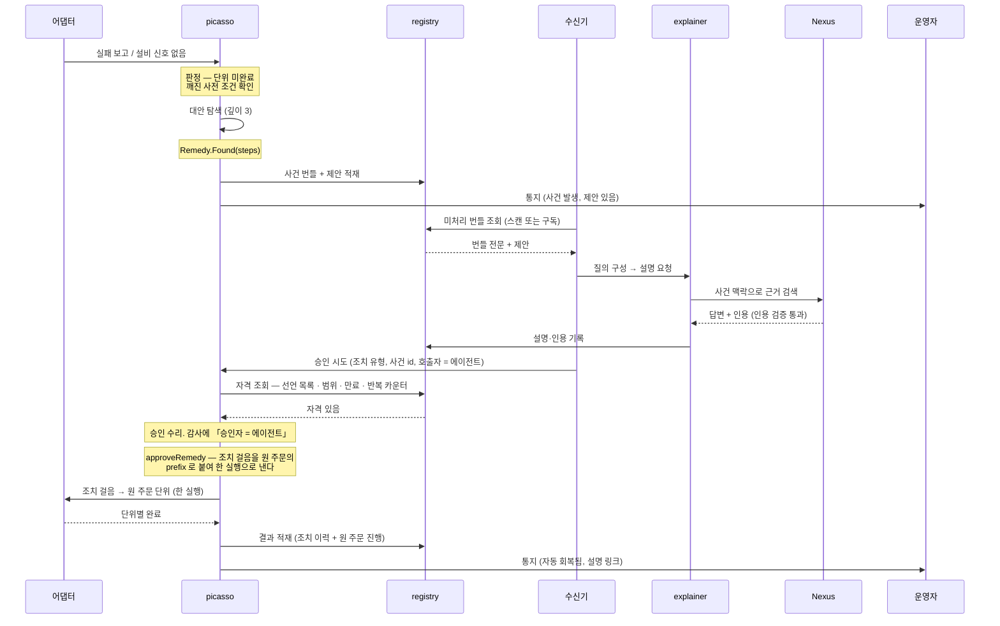
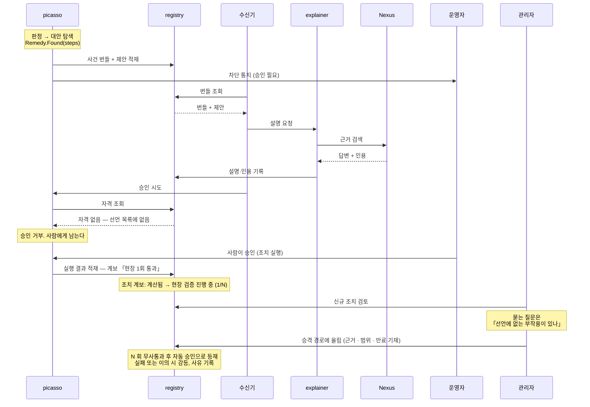
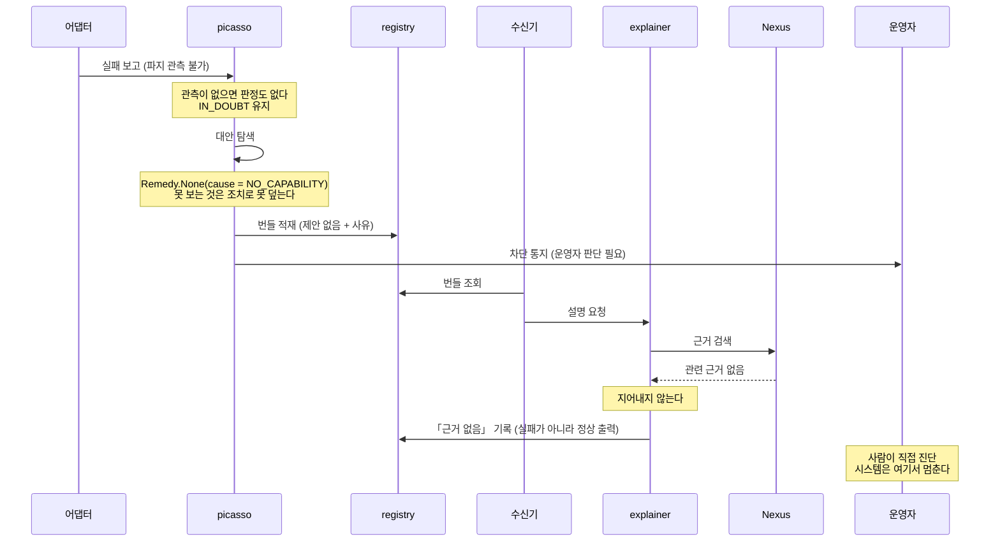
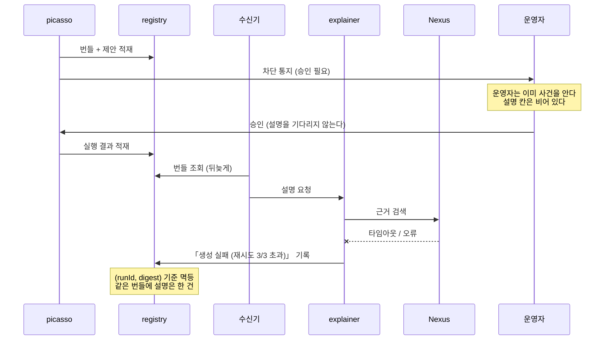
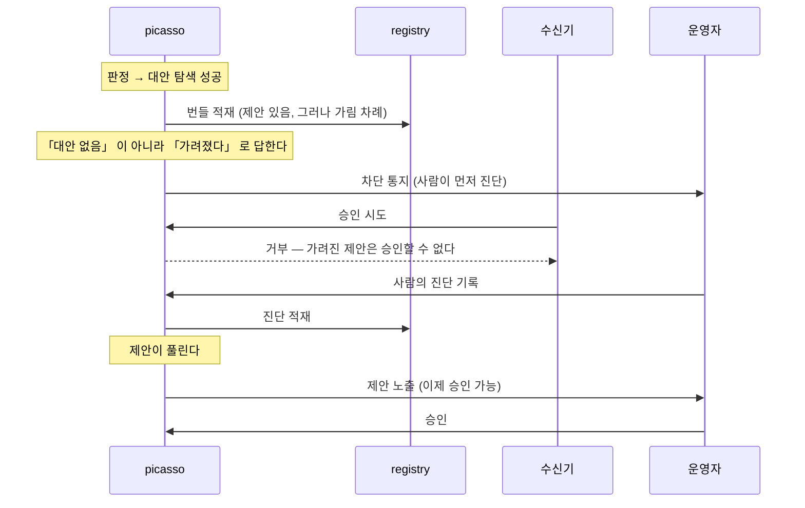
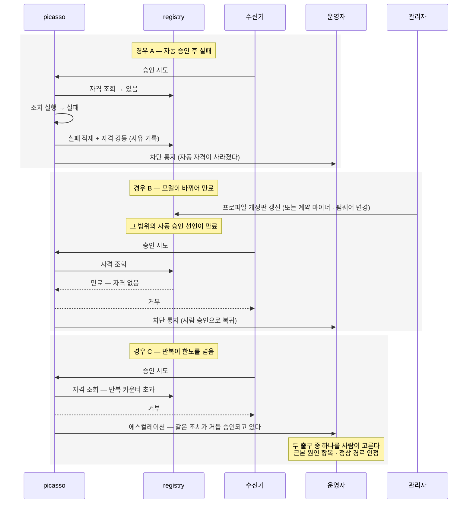

# 시퀀스 — 여섯 가지 운영 경로

- 작성 2026-09-17 · 저장소로 이주 2026-09-18 · 짝: `BOUNDARY.md`
- **이 문서가 이 층의 시퀀스 정본이다.** `AGENT-02` 파트 C 와 `_source/narrator-SEQUENCES.md` 는 사본이고, 어긋나면 이 문서가 이긴다
- ⚠ `_source/narrator-SEQUENCES.md`(9/17 판)의 시퀀스 1 은 **틀렸다** — 「막혀 있던 원 주문 재개」라는 상태는 이 층에 없다. 그 판을 보고 만들지 않는다(§1 과 `BOUNDARY.md` §9)
- 참가자 표기: **어댑터**(로봇 한 쌍) · **picasso**(미들웨어) · **적재**(두 대장 + 현장 정책) · **수신기**·**explainer**(narrator 의 두 조각) · **Nexus** · **운영자** · **관리자**

### 참가자 `registry` 를 읽는 법 (2026-09-18)

아래 그림들은 권위 있는 적재처를 `R as registry` 로 표기한다. **그것은 역할 이름이지 모듈 이름이 아니다.** 두 가지가 그 뒤에 바뀌었으므로 함께 읽는다.

- **적재는 v1 에서 파일이다.** 두 대장은 `incidents.jsonl` · `remedy-searches.jsonl` 로 나오고 `manifest.json` 이 한 벌의 신호다. `registry` 로 올라가는 것은 승격 조건 셋 중 하나가 설 때다(`BOUNDARY.md` §3.1)
- **자격 조회는 `registry` 로 가지 않는다.** 선언 목록은 picasso 가 생성자 주입 포트로 받으며 설정 파일과 `registry` 는 그 포트의 구현체다(`ADR 43`). 그리고 **포트가 답하는 것은 선언뿐이다** — 그림의 `자격 조회` 에 적힌 「반복 카운터」는 picasso 가 자기 안에서 세므로 포트에 묻지 않는다

**이 층이 달라지는 것은 없다.** 어느 쪽이든 narrator 는 한 벌을 읽고 승인을 시도할 뿐이며, 자격은 판단하지 않는다(불변식 2).

## 읽는 방법 — 세 가지 불변식

여섯 다이어그램 모두 아래를 지킨다. 지키지 않는 배선이 보이면 그것이 결함이다.

1. **picasso 는 narrator 를 호출하지 않는다.** 적재하고, 수신기가 집어온다
2. **자격은 승인 API 가 판정한다.** narrator 는 승인을 *시도*하고, picasso 가 호출자 신원과 선언 목록을 대조해 허락하거나 거부한다. narrator 가 스스로 자격을 판단하면 우회가 가능해진다
3. **설명은 사건 처리의 앞이 아니라 옆이다.** 설명이 없어도 운영자는 사건을 알고 승인할 수 있다

## PoC 범위

| 우선 | 경로 | 드는 것 | 상태 |
|---|---|---|---|
| **P1** | 4 설명이 늦거나 실패 | 이 저장소만 | v1 |
| **P2** | 3 대안 없음 · 근거 없음 | 이 저장소만 | v1 |
| **P3** | 1 알려진 조치로 자동 회복 | picasso 변경 2 + 선언 목록 | v1. 픽스처와 실물 창구 둘 다 종단 (2026-09-22, `python -m receiver --approve`, 두 바퀴) |
| **P4** | 5 의도적 비자동화 | 확인 시험 하나 | v1 |
| **P5** | 6 자격 강등 (경우 A 만) | P3 에 딸려온다 | v1 |
| 제외 | 2 신규 조치 승격 | 관리자 검토 화면 + 계보 상태 기계 | 설계만 |

**데모 순서 P1 → P2 → P3 → P4·P5.** 마지막이 가장 설득력 있는 자리다 — 도는 것보다 **멈추는 것**을 보이는 쪽이 낫다.

---
## 1. 알려진 조치로 자동 회복 — 자격이 선언돼 있는 경우

**증명하는 것.** 회복이 narrator 의 실행이 아니라 **picasso 의 실행**이라는 것. narrator 가 보낸 것은 승인 한 번이고, 자격 판정은 picasso 가 registry 의 선언 목록으로 한다. 운영자는 두 번 통지받는다 — 사건 발생 시 한 번, 자동 회복 후 한 번. 차단은 없다.

**「막혀 있던 원 주문」이라는 상태는 이 층에 없다(9/17 정정).** 거절된 주문은 실행을 만들지 않았으므로 picasso 가 보관하지 않는다 — 승인자가 주문을 **다시 넘긴다**(`approveRemedy(order, robotId, parameters)`). 그리고 조치와 원 주문은 두 번의 하달이 아니라 **한 실행**이다. 이전 판의 그림대로 만들면 없는 보관 상태와 없는 재개 경로를 만들게 된다.

**설명과 승인의 순서는 고정이 아니다.** 위 그림은 설명이 먼저 붙은 경우고, 승인이 먼저 수리돼도 무방하다. 설명은 사건 처리의 전제가 아니다(불변식 3).

---

## 2. 신규 조치 제안 — 아무도 실행한 적 없는 경우

**증명하는 것.** 관리자 승인이 **자동화가 아니라 승격 경로에 올림**이라는 것. 신규 조치는 관리자가 봐도 바로 자동 승인이 되지 않고, 현장 N 회를 거친다. 그리고 관리자 검토의 질문이 "목표를 달성하나"가 아니라 "선언에 없는 부작용이 있나"다 — 목표 달성은 탐색기가 이미 계산했다.

**미믹 재생을 끼우는 변형.** 관리자가 검토 전에 그 조치를 에뮬레이터에서 재생해 볼 수 있다. 통과하면 계보가 「시뮬 검증됨」으로 한 칸 오른다. 현장 N 회보다 싼 검증이라 먼저 두는 편이 낫다.

---

## 3. 대안 없음 — 「모른다」가 정상 출력인 경로

> **실물 보정(2026-09-18).** 위 그림은 번들이 「제안 없음 + 사유」를 함께 싣는 것처럼 그렸는데, 구현은 그렇지 않다. **거절은 실행을 만들지 않아 사건 번들이 되지 못하므로**, 탐색의 답은 `remedy-searches.jsonl` 이라는 **별도 대장**에 `(기체, 주문)` 을 열쇠로 남는다(picasso `RemedyLedger` · `docs/orchestration.md` §6). 읽는 쪽은 둘을 각각 열거하고 각각 설명한다. 이 경로(대안 없음)의 실제 입력은 **사건이 아니라 탐색 줄**이다.

**증명하는 것.** 네 가지가 서로 다른 상태로 구별된다는 것 — **대안 없음**(탐색 결과), **근거 없음**(검색 결과), **인용 없는 답**(합성 결과), **아직 오지 않음**(설명 미도착). 빈 칸 하나로 접으면 운영자가 넷을 구별하지 못한다. 그리고 `NO_CAPABILITY` 와 `DEPTH_LIMIT` 이 갈리므로 운영자는 "이 기체로는 안 된다"와 "더 찾아보면 있을 수 있다"를 구별한다.

> **실물 보정(2026-09-19).** 위 그림의 `관련 근거 없음` 은 **둘 중 하나만 그린 것이다.** 실물에서 Nexus 는 인용 0 건을 두 가지 이유로 낸다 — 검색이 못 덮어서(`weak_evidence=true`, 답 90자)와 **근거는 맞았는데 합성이 인용을 못 붙여서**(`weak_evidence=false`, 답 2,510자). 뒤엣것을 「근거 없음」으로 적으면 **코퍼스에 대해 거짓을 말하는 것**이고 §7 의 감시 신호가 멀쩡한 코퍼스를 가리킨다(`BOUNDARY.md` §3.4). 이 경로는 앞엣것만 그린다.

> **실물 보정(2026-09-18).** `DEPTH_LIMIT` 은 미들웨어 경로로 도달하지 못한다(picasso §15.170). 위 문장은 값이 갈린다는 사실로는 맞고, **운영자가 실제로 그 둘을 보게 된다는 뜻으로는 아직 아니다.** 상태 축에 파지 말고 다른 것이 들어와야 밟힌다.

---

## 4. 설명이 늦거나 실패 — 사건 처리는 진행된다

**증명하는 것.** 판정은 결정적이고 설명은 비결정적이라는 비대칭. 설명 경로가 통째로 죽어도 사건은 처리된다. **이 순서가 뒤집혀 설명을 기다려야 화면이 채워지면 그 순간 LLM 이 운영 경로에 들어간 것이다.** 그리고 실패 사유를 기록하므로 운영자가 **"아직인가, 실패인가, 근거가 없어서인가, 근거는 맞는데 인용을 못 댄 것인가"**를 구별한다 — 넷은 다음에 할 일이 각각 다르다(`BOUNDARY.md` §3.4).

---

## 5. 의도적 비자동화 — 사람이 먼저 진단해야 풀린다

**증명하는 것.** 훈련 지분을 시스템이 강제한다는 것. 가림은 **대안 없음으로 위장하지 않는다** — 그러면 사람이 "없구나" 하고 넘어가고 훈련 효과가 0 이 된다. 「가려졌다」로 말하고, 사람의 진단이 기록된 뒤에만 풀린다.

---

## 6. 자격의 강등 — 실패 또는 만료

**증명하는 것.** 자동 자격이 **한 방향으로만 움직이지 않는다**는 것. 올라가는 데는 사람의 선언과 N 회 통과가 필요하고, 내려오는 데는 실패 한 번·모델 변경 한 번·반복 한도 초과 한 번으로 충분하다. 비대칭이 의도적이다.

경우 C 가 특히 중요하다. 반복이 한도를 넘으면 **시스템이 스스로 고발하고 사람에게 출구를 고르게 한다.** 시스템이 출구를 정하면 증상 우회가 자동화된다.

---

## 더 그릴 만한 것 — 이 문서에 없는 경로

- **교대 종료 요약과 사후 검토** — 사람이 읽고 동의·이의를 달고 이의율이 집계되는 경로. 개별 사건이 아니라 묶음이라 시퀀스보다 표가 맞을 수 있다
- **발신자 거절 경로**(§15.150) — 어댑터 호스트가 접수를 거절한 경우. 이 층에 파지 관측이 없어 대안을 계산하지 못하므로, 그림을 그리면 빠진 화살표가 드러난다. 그 자체로 한계의 증거가 된다
